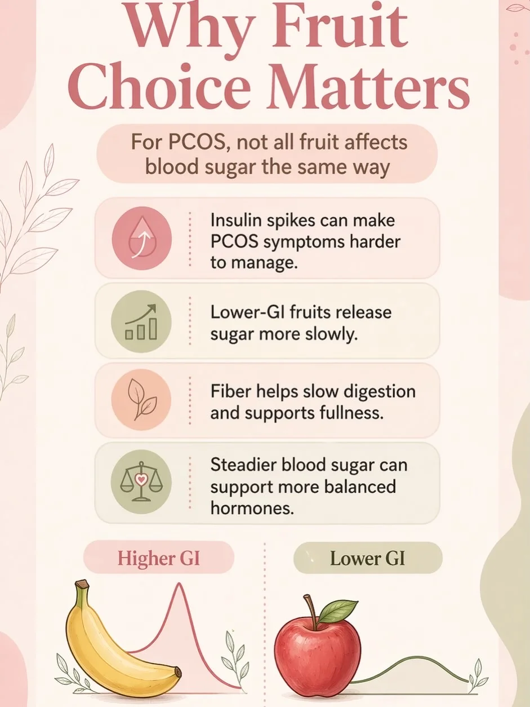

# CycleBalance Media — PCOS Educational Image Library

Optimized image library for use across CycleBalance blog posts, social, and educational content.

All images are WebP, max 1600px wide, EXIF-stripped, ready for blog use on GitHub Pages.


## At a glance

- **134 images** across 12 categories
- **139.0 MB → 16.3 MB** (88% reduction)
- Format: WebP, quality 85, max width 1600px
- All EXIF/GPS metadata stripped

## Folder structure

```
PCOS_Management_Images/
├── app-and-branding/  (20 images)
├── nutrition-general/  (14 images)
├── nutrition-protein/  (12 images)
├── nutrition-fruits/  (14 images)
├── nutrition-carbs/  (12 images)
├── nutrition-fats/  (6 images)
├── nutrition-vegetables/  (9 images)
├── supplements/  (26 images)
├── cycle-tracking-symptoms/  (6 images)
├── hormone-insulin/  (4 images)
├── lifestyle/  (6 images)
├── misc-flagged/  (5 images)
```

## Using these images for SEO / LLMO

Every filename is a descriptive, keyword-rich slug. The `alt-text-reference.csv` and `alt-text-reference.json` files in this folder contain ready-to-paste HTML alt text for each image.

**For blog markdown:**
```markdown

```

**For HTML / Hugo / Jekyll:**
```html

```

**LLM-friendly metadata** is in `alt-text-reference.json` — use it to generate sitemaps, schema.org `ImageObject` markup, or feed into your CMS programmatically.

---

## Full image index

### `app-and-branding/`  *(20 images)*

_CycleBalance app screens, brand marks, and App Store callouts. Use for product/landing pages, app announcements, and brand-forward blog posts._

| Filename | Suggested alt text | Size |
|---|---|---|
| `cyclebalance-available-in-apple-ios-store.webp` | CycleBalance available in the Apple iOS Store | 23.6 KB |
| `cyclebalance-available-on-apple-ios-store.webp` | CycleBalance available on the Apple iOS App Store | 23.8 KB |
| `cyclebalance-download-on-the-app-store.webp` | Download CycleBalance on the App Store | 24.5 KB |
| `cyclebalance-logo-dark-mode.webp` | CycleBalance brand logo on dark background | 45.7 KB |
| `cyclebalance-moon-logo-mark.webp` | CycleBalance brand logo mark in pastel gradient | 14.9 KB |
| `cyclebalance-period-log-day-one-screen.webp` | CycleBalance app: Day 1 of current cycle, period logging screen | 52.3 KB |
| `cyclebalance-start-tracking-irregular-periods-pcos.webp` | Start tracking with CycleBalance: irregular periods, PCOS symptoms, glucose | 96.7 KB |
| `cyclebalance-tracking-symptoms-and-glucose.webp` | CycleBalance promo: track irregular periods, PCOS symptoms, and glucose in one place | 88.8 KB |
| `feel-supported-every-day-cyclebalance.webp` | CycleBalance app screen: feel supported every day with gentle PCOS reminders | 82.2 KB |
| `find-pcos-patterns-that-matter-cyclebalance.webp` | Find patterns that matter — CycleBalance PCOS insights screen | 79.1 KB |
| `log-what-you-feel-cyclebalance-app.webp` | CycleBalance app screen for logging PCOS symptoms and how you feel | 71.8 KB |
| `made-for-irregular-cycles-cyclebalance.webp` | CycleBalance: an app made for irregular PCOS cycles | 75.8 KB |
| `meet-cyclebalance-app-iphone-mockup.webp` | Meet CycleBalance: PCOS tracking app shown on iPhone | 73.0 KB |
| `smarter-cycle-predictions-cyclebalance.webp` | CycleBalance smarter cycle predictions iPhone app screen for PCOS | 84.2 KB |
| `start-tracking-cyclebalance-symptoms-glucose-energy.webp` | Start tracking with CycleBalance: irregular periods, PCOS symptoms, glucose, cravings, energy | 110.8 KB |
| `start-tracking-pcos-with-cyclebalance.webp` | CycleBalance branded promo: start tracking PCOS symptoms, glucose, and irregular periods | 136.3 KB |
| `track-pcos-symptoms-patterns-cycles-app-store.webp` | Track PCOS symptoms, patterns, and cycles — App Store callout | 31.9 KB |
| `track-what-works-for-your-body-cyclebalance.webp` | CycleBalance app mockup showing personalized PCOS cycle tracking on iPhone | 119.1 KB |
| `track-your-pcos-symptoms-consistently.webp` | Track your PCOS symptoms consistently with CycleBalance | 70.2 KB |
| `you-can-make-pcos-work-better-for-you.webp` | You can make PCOS work better for you — CycleBalance lifestyle promo | 137.8 KB |

### `nutrition-general/`  *(14 images)*

_Cross-cutting PCOS nutrition, plate-building, and "5 ways to manage" guides._

| Filename | Suggested alt text | Size |
|---|---|---|
| `best-foods-for-pcos-illustrated-plate.webp` | Best foods for PCOS — illustrated balanced plate | 62.5 KB |
| `best-foods-for-pcos-styled-illustration.webp` | Best foods for PCOS — styled illustration | 33.1 KB |
| `best-foods-for-pcos-styled-plate.webp` | Best foods for PCOS: styled plate with salmon, vegetables, fruit | 53.6 KB |
| `build-a-pcos-friendly-plate.webp` | How to build a PCOS-friendly plate | 146.5 KB |
| `five-ways-to-help-manage-pcos-symptoms.webp` | Five ways to help manage PCOS symptoms | 35.2 KB |
| `if-you-have-pcos-this-may-explain-a-lot.webp` | If you have PCOS, this may explain a lot — symptom and cycle education | 63.8 KB |
| `pcos-choose-more-limit-more-foods.webp` | PCOS: foods to choose more and limit more | 144.7 KB |
| `pcos-is-manageable-with-consistency.webp` | PCOS is manageable, but it usually takes consistency | 43.4 KB |
| `seeds-and-smart-add-ins-pcos.webp` | Seeds and smart add-ins for PCOS: chia, flax, pumpkin | 125.9 KB |
| `taking-back-control-managing-pcos-through-nutrition.webp` | Taking back control: managing PCOS through nutrition | 220.5 KB |
| `the-science-fiber-helps-pcos.webp` | The science: fiber helps PCOS blood sugar | 74.2 KB |
| `the-science-of-fiber-pcos-blood-sugar.webp` | The science of fiber: how it supports PCOS blood sugar balance | 100.5 KB |
| `what-to-reach-for-pcos-grains-fiber-detailed.webp` | What to reach for with PCOS: grains, fiber, fruit — detailed | 108.6 KB |
| `what-to-reach-for-pcos-whole-grains-fiber-fruit.webp` | What to reach for with PCOS: whole grains, fiber-rich staples, whole fruit | 145.0 KB |

### `nutrition-protein/`  *(12 images)*

_Protein-focused PCOS nutrition graphics. Use for posts on protein strategy, blood sugar balance, and meal building._

| Filename | Suggested alt text | Size |
|---|---|---|
| `best-pcos-proteins-eggs-salmon-chicken-beef.webp` | Best PCOS proteins: pasture-raised eggs, wild salmon, chicken, beef, turkey, bone broth | 56.9 KB |
| `best-pcos-proteins-quick-guide.webp` | Best PCOS proteins quick visual guide | 47.0 KB |
| `build-pcos-meals-around-protein-and-fiber.webp` | Build PCOS meals around protein and fiber for blood sugar balance | 58.8 KB |
| `pcos-protein-checklist-for-every-meal.webp` | PCOS protein checklist: easy ways to add protein to every meal | 149.5 KB |
| `pcos-protein-strategy-protein-fiber-fat.webp` | The PCOS protein strategy: protein + fiber + fat at every meal | 143.2 KB |
| `plant-proteins-pull-double-duty-for-pcos.webp` | Plant proteins pull double duty for PCOS: lentils, chickpeas, flaxseeds | 164.9 KB |
| `protein-strategies-for-pcos-balance-infographic.webp` | Protein strategies for PCOS balance: soy, omega-3 fish, fiber-packed plant proteins | 305.8 KB |
| `soy-foods-are-a-great-pcos-option.webp` | Soy foods are a great option for PCOS: tofu, tempeh, edamame | 146.2 KB |
| `start-the-day-with-protein-pcos-breakfast-ideas.webp` | Start the day with protein: PCOS-friendly breakfast ideas | 152.4 KB |
| `the-power-of-protein-for-pcos-balance.webp` | The power of protein for PCOS balance — protein, fiber, fat strategy | 193.5 KB |
| `use-the-palm-sized-protein-rule-pcos.webp` | Use the palm-sized protein rule for PCOS-friendly meals | 168.4 KB |
| `why-protein-matters-for-pcos.webp` | Why protein matters for PCOS: blood sugar, satiety, hormone support | 119.6 KB |

### `nutrition-fruits/`  *(14 images)*

_Fruit selection guides for PCOS. Use for posts on glycemic load, smart fruit choices, and berries._

| Filename | Suggested alt text | Size |
|---|---|---|
| `best-pick-berries-for-pcos.webp` | Best pick: berries for PCOS — low glycemic, high fiber, antioxidant rich | 135.2 KB |
| `best-pick-berries-pcos-snacking-guide.webp` | Best pick: berries — a favorite fruit group for PCOS-friendly snacking | 108.9 KB |
| `pcos-and-fruit-condensed-tips.webp` | PCOS and fruit: condensed tips for hormone-friendly snacking | 109.8 KB |
| `pcos-and-fruit-quick-guide.webp` | PCOS and fruit: a quick guide to hormone-friendly choices | 63.3 KB |
| `pcos-and-fruit-quick-overview.webp` | PCOS and fruit quick visual overview | 177.0 KB |
| `pcos-friendly-fruit-also-great-choices.webp` | PCOS-friendly fruit: also great choices for blood sugar balance | 121.6 KB |
| `pcos-fruit-choices-overview.webp` | PCOS fruit choices overview: berries, apples, citrus and more | 90.6 KB |
| `pcos-fruit-guide-natures-best-detailed.webp` | PCOS fruit guide: nature's best for hormone balance — detailed reference | 166.9 KB |
| `pcos-fruit-tips-blood-sugar-friendly.webp` | PCOS fruit tips: blood-sugar-friendly fruit pairings | 100.8 KB |
| `quick-pcos-fruit-tips-snack-ideas.webp` | Quick PCOS fruit tips: easy snack ideas to keep blood sugar steady | 124.1 KB |
| `the-pcos-fruit-guide-detailed-infographic.webp` | The PCOS fruit guide: detailed nutrition infographic | 219.6 KB |
| `the-pcos-fruit-guide-natures-best-for-hormone-balance.webp` | The PCOS fruit guide: nature's best fruit for hormone balance | 168.6 KB |
| `why-fruit-choice-matters-for-pcos-detailed.webp` | Why fruit choice matters for PCOS — detailed glycemic comparison | 100.5 KB |
| `why-fruit-choice-matters-for-pcos.webp` | Why fruit choice matters for PCOS: high vs low glycemic fruits | 74.0 KB |

### `nutrition-carbs/`  *(12 images)*

_Carb strategy and blood-sugar education. Use for posts dispelling "low-carb" myths, carb pairing, and PCOS-friendly grains._

| Filename | Suggested alt text | Size |
|---|---|---|
| `best-pcos-carbs-quick-guide.webp` | Best PCOS carbs quick visual guide: oats, quinoa, lentils, sweet potato | 47.3 KB |
| `carbs-are-not-the-problem-pcos-insulin-resistance.webp` | Carbs aren't the problem: PCOS insulin resistance and blood sugar | 121.0 KB |
| `carbs-arent-the-problem-blood-sugar-swings-are.webp` | Carbs aren't the problem — blood sugar swings can be | 98.4 KB |
| `manage-pcos-carbs-with-strategy-not-restriction.webp` | Manage PCOS carbs with strategy, not restriction | 146.8 KB |
| `pair-carbs-with-protein-fat-fiber-pcos.webp` | Pair carbs with protein, fat, and fiber for PCOS blood sugar balance | 139.8 KB |
| `pair-carbs-with-protein-fat-fiber-recipe-example.webp` | Pair carbs with protein, fat, fiber — PCOS recipe pairing example | 160.8 KB |
| `pcos-and-carbs-you-do-not-need-to-cut-them-out.webp` | PCOS and carbs: you do NOT need to cut them out | 121.1 KB |
| `pcos-carb-blueprint-hall-of-fame-detailed-infographic.webp` | PCOS carb blueprint hall of fame — detailed infographic | 217.9 KB |
| `pcos-carb-guide-do-not-cut-them-out-detailed.webp` | PCOS carb guide: you do not need to cut them out — detailed | 155.2 KB |
| `pcos-carb-smart-swaps-hormone-balance-detailed.webp` | PCOS carb smart swaps for hormone balance — detailed reference | 181.1 KB |
| `pcos-carbohydrate-blueprint-best-carbs-hall-of-fame.webp` | PCOS carbohydrate blueprint: best carbs hall of fame | 244.6 KB |
| `the-pcos-carbohydrate-blueprint-smart-swaps.webp` | The PCOS carbohydrate blueprint: smart swaps for hormone balance | 188.5 KB |

### `nutrition-fats/`  *(6 images)*

_Healthy fats and PCOS hormone production. Use for posts on omega-3s, monounsaturated fats, and cooking oils._

| Filename | Suggested alt text | Size |
|---|---|---|
| `best-fats-for-pcos-balance-detailed.webp` | Best fats for PCOS balance — detailed nutrition infographic | 202.6 KB |
| `best-pcos-fats-avocado-olive-oil-flax-chia.webp` | Best PCOS fats: avocado, olive oil, flax seeds, chia seeds, nut butters | 43.4 KB |
| `monounsaturated-fats-for-pcos.webp` | Monounsaturated fats for PCOS: avocado, olive oil, almonds | 115.9 KB |
| `omega-3-fats-for-pcos-inflammation.webp` | Omega-3 fats for PCOS: lower inflammation and support metabolism | 133.0 KB |
| `the-best-fats-for-pcos-balance.webp` | The best fats for PCOS balance: avocado, olive oil, salmon, nuts | 159.4 KB |
| `why-healthy-fats-matter-for-pcos.webp` | Why healthy fats matter for PCOS hormone production | 116.2 KB |

### `nutrition-vegetables/`  *(9 images)*

_Vegetable guides emphasizing nutrient-dense greens. Use for veggie-forward posts and meal-planning content._

| Filename | Suggested alt text | Size |
|---|---|---|
| `best-pcos-veggies-broccoli-spinach-cauliflower.webp` | Best PCOS veggies: broccoli, spinach, zucchini, bell pepper, cauliflower, brussels sprouts | 43.7 KB |
| `best-vegetables-for-pcos-circle-guide.webp` | Best vegetables for PCOS: visual circle guide | 125.3 KB |
| `best-vegetables-for-pcos-management.webp` | The best vegetables for PCOS management: nutrient-dense greens | 176.6 KB |
| `easy-ways-to-eat-more-veggies-pcos.webp` | Easy ways to eat more vegetables for PCOS | 142.9 KB |
| `nutrient-dense-greens-pcos-detailed-strategy.webp` | Nutrient-dense greens for PCOS — detailed strategy infographic | 220.7 KB |
| `nutrient-dense-greens-pcos-veg-detailed-guide.webp` | Nutrient-dense greens for PCOS — detailed vegetable selection guide | 178.8 KB |
| `nutrient-dense-greens-pcos-veg-guide.webp` | Nutrient-dense greens: best vegetables for PCOS management | 179.1 KB |
| `top-vegetables-to-focus-on-for-pcos.webp` | Top vegetables to focus on for PCOS hormone balance | 155.2 KB |
| `why-vegetables-matter-for-pcos.webp` | Why vegetables matter for PCOS: fiber, antioxidants, hormone health | 108.2 KB |

### `supplements/`  *(26 images)*

_Inositol, magnesium, omega-3, vitamin D, zinc, and spearmint education. Use for supplement deep-dives._

| Filename | Suggested alt text | Size |
|---|---|---|
| `a-gentle-reminder-pcos-supplements-consistency.webp` | A gentle reminder: consistency matters with PCOS supplements | 159.6 KB |
| `inositol-may-help-regulate-cycles-pcos.webp` | Inositol may help regulate cycles for PCOS | 182.0 KB |
| `inositol-myo-d-chiro-supports-insulin-sensitivity.webp` | Inositol (myo + d-chiro) supports insulin sensitivity for PCOS | 138.8 KB |
| `inositol-supports-hormone-balance-pcos.webp` | Inositol can support hormone balance for PCOS | 159.7 KB |
| `inositol-supports-insulin-sensitivity-pcos.webp` | Inositol supports insulin sensitivity for PCOS | 143.0 KB |
| `inositol-the-one-pcos-supplement-that-gets-attention.webp` | Inositol: the PCOS supplement that gets a lot of attention | 144.8 KB |
| `magnesium-and-pcos-overview.webp` | Magnesium and PCOS: how this gentle supplement supports symptoms | 161.4 KB |
| `magnesium-for-cramps-and-comfort-pcos.webp` | Magnesium for menstrual cramps and comfort in PCOS | 182.7 KB |
| `magnesium-for-cravings-and-blood-sugar-balance-pcos.webp` | Magnesium for cravings and blood sugar balance in PCOS | 190.2 KB |
| `magnesium-for-sleep-and-fatigue-pcos.webp` | Magnesium for sleep and fatigue support in PCOS | 172.4 KB |
| `magnesium-for-stress-and-mood-pcos.webp` | Magnesium for stress and mood support in PCOS | 165.5 KB |
| `magnesium-stress-cortisol-pcos.webp` | Magnesium helps with stress, cortisol balance, sleep, and cramps for PCOS | 144.0 KB |
| `magnesium-stress-fatigue-pcos.webp` | Magnesium for PCOS: support for stress, fatigue, sleep, and cramps | 165.9 KB |
| `not-all-pcos-supplements-look-the-same.webp` | Not all PCOS supplements look the same — what to know | 149.6 KB |
| `omega-3-and-pcos-scientific-benefits.webp` | Omega-3 and PCOS: scientific benefits worth knowing | 169.4 KB |
| `omega-3-fish-oil-pcos-inflammation.webp` | Omega-3 fish oil for PCOS: lower inflammation, support hormone balance | 144.0 KB |
| `omega-3-may-help-lower-inflammation-pcos.webp` | Omega-3 may help lower inflammation in PCOS | 183.3 KB |
| `omega-3-may-support-hormone-balance-pcos.webp` | Omega-3 may support hormone balance for PCOS | 175.7 KB |
| `omega-3-mood-and-overall-wellbeing-pcos.webp` | Omega-3 may support mood and overall wellbeing in PCOS | 169.3 KB |
| `omega-3-rich-fish-can-be-helpful-pcos.webp` | Omega-3 rich fish can be helpful for PCOS: salmon, mackerel, sardines | 128.7 KB |
| `omega-3-supports-heart-and-triglyceride-health-pcos.webp` | Omega-3 supports heart and triglyceride health for women with PCOS | 168.2 KB |
| `omega-3-supports-insulin-sensitivity-pcos.webp` | Omega-3 supports insulin sensitivity in PCOS | 163.5 KB |
| `vitamin-d-pcos-hormone-immune-support.webp` | Vitamin D and PCOS: hormone, immune, and cycle support | 120.9 KB |
| `what-is-inositol-pcos-explained.webp` | What is inositol? PCOS supplement explained | 161.1 KB |
| `why-magnesium-matters-for-pcos.webp` | Why magnesium matters for PCOS: stress, sleep, cramps, fatigue | 182.9 KB |
| `zinc-and-spearmint-for-pcos-acne-androgens.webp` | Zinc or spearmint for PCOS: acne, androgens, and clearer skin | 145.8 KB |

### `cycle-tracking-symptoms/`  *(6 images)*

_Symptom and cycle education — irregular periods, cramps, mood, acne, cravings, patterns._

| Filename | Suggested alt text | Size |
|---|---|---|
| `acne-and-cravings-pcos-helpful-clues.webp` | Acne and cravings are helpful PCOS clues to track | 145.2 KB |
| `cramps-tell-part-of-the-pcos-story.webp` | Cramps tell part of the PCOS story: mild, moderate, severe | 134.0 KB |
| `cycle-length-and-missed-periods-pcos.webp` | Cycle length and missed periods: what they mean for PCOS | 132.5 KB |
| `irregular-periods-are-not-just-random-pcos.webp` | Irregular periods are not just random — what they reveal about PCOS | 112.2 KB |
| `mood-and-energy-follow-a-pattern-pcos.webp` | Mood and energy often follow a pattern in PCOS | 135.6 KB |
| `patterns-become-clearer-together-pcos-tracking.webp` | Patterns become clearer together: PCOS cycle tracking insight | 163.2 KB |

### `hormone-insulin/`  *(4 images)*

_Hormone chain reaction and insulin resistance content. Use for posts on the metabolic side of PCOS._

| Filename | Suggested alt text | Size |
|---|---|---|
| `blood-sugar-fertility-connection-pcos.webp` | The blood sugar–fertility connection in PCOS | 231.0 KB |
| `hormone-chain-reaction-blood-sugar-detailed-pcos.webp` | Hormone chain reaction: blood sugar impacts your body — detailed | 199.0 KB |
| `hormone-chain-reaction-blood-sugar-impacts-body-pcos.webp` | The hormone chain reaction: how blood sugar impacts your body in PCOS | 195.7 KB |
| `pcos-and-insulin-resistance-hidden-connection-weight.webp` | PCOS and insulin resistance: the hidden connection to weight gain | 187.4 KB |

### `lifestyle/`  *(6 images)*

_Sleep, stress, movement, and "5 ways to heal PCOS" lifestyle pieces._

| Filename | Suggested alt text | Size |
|---|---|---|
| `five-ways-to-heal-pcos-hormonal-imbalance-callout.webp` | Five ways to heal PCOS hormonal imbalance — callout cover | 41.5 KB |
| `five-ways-to-heal-pcos-hormonal-imbalance.webp` | Five ways to heal PCOS hormonal imbalance | 205.8 KB |
| `heal-pcos-hormonal-imbalance-character-cover.webp` | Heal PCOS hormonal imbalance — illustrated character cover | 49.2 KB |
| `reduce-stress-load-for-pcos.webp` | Reduce stress load for PCOS hormone balance | 30.1 KB |
| `sleep-like-it-matters-pcos.webp` | Sleep like it matters: PCOS-friendly sleep habits | 38.8 KB |
| `walk-more-add-strength-training-pcos.webp` | Walk more and add strength training to support PCOS insulin sensitivity | 52.2 KB |

### `misc-flagged/`  *(5 images)*

_FLAGGED OFF-TOPIC — kept per your direction. Review before using these in any blog post._

| Filename | Suggested alt text | Size |
|---|---|---|
| `benjamin-franklin-daily-schedule.webp` | Benjamin Franklin daily schedule reference — flagged off-topic | 126.9 KB |
| `field-service-dashboard-screenshot.webp` | Field service dashboard screenshot — flagged unrelated | 48.4 KB |
| `pinterest-screenshot-misc-1.webp` | Pinterest screenshot of doodles — flagged off-topic | 61.3 KB |
| `pinterest-screenshot-misc-2.webp` | Pinterest screenshot of doodles — flagged off-topic | 39.5 KB |
| `rabbit-rainbow-meme.webp` | Rabbit rainbow meme — flagged off-topic | 14.7 KB |

---

## Notes on flagged images

The 5 images in `misc-flagged/` were detected as off-topic during review (rabbit memes, an unrelated dashboard screenshot, and a Benjamin Franklin schedule). They were processed and included per your direction but should be reviewed before any public use.

## Provenance

- Source: 137 raw files from CycleBalance Media folder
- 1 exact-duplicate removed via MD5 hashing
- 2 video files (.mp4, .mov) skipped — host on YouTube/Vimeo for blog embedding
- All EXIF/GPS metadata stripped during WebP conversion