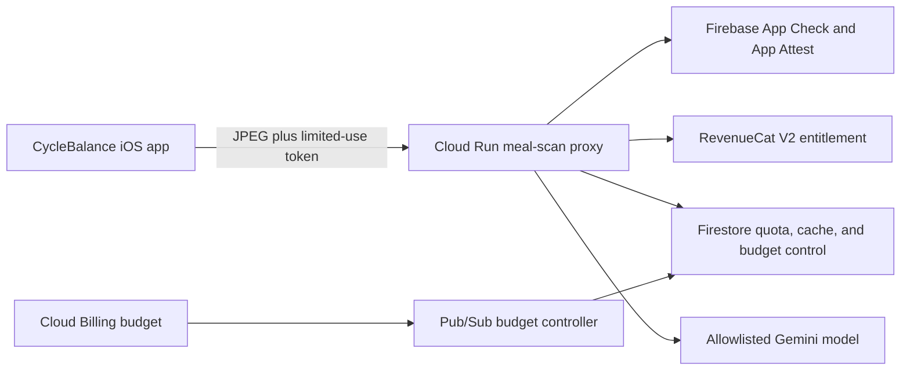

# CycleBalance Meal Scan Production Runbook

This runbook records the deployed CycleBalance meal-photo estimate architecture, its cost controls, and the remaining gates before users can access it.

## Architecture

The iOS app never calls Gemini directly. After the user chooses Photo Estimate, it normalizes one JPEG and requests a limited-use Firebase App Check token backed by Apple App Attest. The Cloud Run proxy verifies the token and app ID, checks RevenueCat access, reuses a matching cached result or consumes Firestore quota, and only then calls an allowlisted model. The app presents one editable nutrition draft before saving reviewed values locally.



Raw photos are not retained by the proxy. Logs contain only hashed identifiers, an image-hash prefix, provider/model metadata, token usage, estimated cost, quota tier, budget mode, and status metadata.

## Live Production Posture

As of July 10, 2026:

- Google Cloud project: `cyclebalance-prod-20260710` (`CycleBalance Production`), project number `947929010052`.
- Region: `us-central1`.
- Proxy service: `cyclebalance-meal-scan-proxy`.
- Proxy URL: `https://cyclebalance-meal-scan-proxy-mdd7lrfyqa-uc.a.run.app`.
- Proxy posture: private and `MEAL_SCAN_ENABLED=false`.
- Firebase iOS app: bundle ID `alex.PCOS`, app ID `1:947929010052:ios:6e68c8645a6a6b5e3057d1`.
- App Check: App Attest provider, 3,600-second token TTL, and limited-use token replay protection.
- RevenueCat: API V2 project `proj8da4e000`, entitlement `CycleBalance Unlimited`.
- Firestore: Native mode in `nam5`; quota and result-cache TTL policies are active.
- Cloud Run limits: two instances, 20 concurrent requests per instance, 30-second request timeout.
- Release app posture: Meal Scan V2, Gemini, mock data, and meal-photo retention remain off; barcode and manual entry remain available.

The production service is intentionally unreachable by mobile clients while disabled. When the release gates pass, it must become publicly invokable because an iOS app cannot hold a Cloud Run IAM credential. Firebase App Check, RevenueCat, quota, validation, and budget gates remain the application-layer protection.

## Model Decision

Use `gemini-2.5-flash-lite` as the short-term default because it is the least expensive compatible model. Keep `gemini-3.1-flash-lite` allowlisted as the migration candidate and compare both on the same labeled meal-photo set before changing the default.

- Do not use `gemini-2.0-flash-lite`; Google shut it down on June 1, 2026.
- Google lists October 16, 2026 as the earliest shutdown date for Gemini 2.5 Flash-Lite.
- Gemini 3.1 Flash-Lite supports image input and structured output and is the recommended replacement, but the representative scan costs about 3.19 times as much in model tokens. Google lists May 7, 2027 as its earliest shutdown date.
- OpenAI GPT-5.6 Luna and Terra support image input and structured output, but no published meal-nutrition benchmark currently demonstrates enough quality gain to justify their substantially higher token cost.

Representative request: 2,448 input tokens and 750 output tokens.

| Model | Input / output per 1M tokens | Model cost per scan | Relative to 2.5 Lite |
|---|---:|---:|---:|
| Gemini 2.5 Flash-Lite | `$0.10 / $0.40` | `$0.0005448` | `1.00x` |
| Gemini 3.1 Flash-Lite | `$0.25 / $1.50` | `$0.0017370` | `3.19x` |
| OpenAI GPT-5.6 Luna | `$1.00 / $6.00` | `$0.0069480` | `12.75x` |
| OpenAI GPT-5.6 Terra | `$2.50 / $15.00` | `$0.0173700` | `31.88x` |

## 100-User Cost Plan

The launch quota remains a five-scan soft warning and ten-scan daily hard cap for paid users. The budget is sized against the more generous planning case of 100 users at 15 scans/day so there is room to tune quotas after observing real usage.

| Model or planning range | 100 users at 10/day (30,000/month) | 100 users at 15/day (45,000/month) |
|---|---:|---:|
| Gemini 2.5 Flash-Lite, model only | `$16.34` | `$24.52` |
| Gemini 3.1 Flash-Lite, model only | `$52.11` | `$78.17` |
| OpenAI GPT-5.6 Luna, model only | `$208.44` | `$312.66` |
| OpenAI GPT-5.6 Terra, model only | `$521.10` | `$781.65` |
| Gemini 3.1 all-in planning range at `$0.002-$0.004/scan` | `$60-$120` | `$90-$180` |

At 25 trial scans, Gemini 3.1 model tokens are about `$0.0434` per trial user; use `$0.05-$0.10` as the all-in planning range. Barcode and manual logging do not call the model and remain unlimited.

Run the checked-in calculator for another scenario:

```sh
node cloud/meal-scan-proxy/scripts/estimate-usage-cost.mjs \
  --users=100 \
  --scans-per-user-per-day=15 \
  --days=30
```

## Budget And Usage Safeguards

The project-scoped Cloud Billing budget is named `CycleBalance Production 100-User Scanner Budget` and is set to `$150/month`. It sends actual-spend notifications at 50%, 75%, 90%, and 100%, plus a forecast notification at 100%.

Google Cloud budgets notify; they do not stop charges. The enforceable scanner controls are:

- `$75`: proxy reports alert mode.
- `$90`: proxy enters degraded mode and forces the least expensive allowlisted model.
- `$120`: proxy rejects scans before App Check, RevenueCat, quota, or Gemini calls.
- `$30`: reserved budget buffer after scanner disablement for notification latency and non-scanner project costs.
- Trial quota: 5 scans/day and 25 scans total.
- Paid quota: warning at 5/day and hard stop at 10/day.
- Cache hit: no model call and no additional scan consumption.
- Capacity limit: at most 40 concurrent proxy requests across two instances.
- Remote kill switch: `mealScanControls/global` can disable the scanner independently of billing.

Gemini's exposed service quotas are tier- and model-specific request/token throughput limits, not a reliable monthly dollar cap. Do not lower an ambiguous per-minute quota as a substitute for the Firestore quotas and billing-triggered kill switch.

## Secret And IAM Rules

Only these server secrets belong in Secret Manager:

- `cyclebalance-gemini-api-key`
- `cyclebalance-revenuecat-secret-api-key`

The proxy service account receives per-secret accessor grants, not project-wide Secret Manager access. The RevenueCat key is limited to read-only Customers and Subscriptions. The Gemini key is restricted to `generativelanguage.googleapis.com`. Proxy, budget-controller, and build service accounts have no user-managed keys.

Never place server secret values in `Info.plist`, `.xcconfig`, `.env`, source files, CI logs, or Cloud Run plain environment variables. The Firebase iOS API key and RevenueCat mobile SDK key are public client identifiers; keep their platform/API restrictions in place, but do not treat them as server credentials.

## Deploy Or Update

Bootstrap a fresh environment only when recreating the project:

```sh
cd "/Users/alexhuggler/Desktop/AI Work/PCOS/PCOS_Management/cloud/meal-scan-proxy"
PROJECT_ID="cyclebalance-prod-20260710" REGION="us-central1" ./scripts/bootstrap-gcp.sh
```

Deploy code changes in the current fail-closed posture:

```sh
cd "/Users/alexhuggler/Desktop/AI Work/PCOS/PCOS_Management/cloud/meal-scan-proxy"
PROJECT_ID="cyclebalance-prod-20260710" REGION="us-central1" ./scripts/deploy-cloud-run.sh
```

The ignored local iOS configuration must escape `//`, because xcconfig otherwise treats it as a comment:

```xcconfig
MEAL_SCAN_PROXY_BASE_URL = https:/$()/cyclebalance-meal-scan-proxy-mdd7lrfyqa-uc.a.run.app
```

Do not enable production with a console click. After all gates pass, use the reviewed deploy script so the complete environment and IAM posture are reproducible:

```sh
MEAL_SCAN_ENABLED=true \
ALLOW_UNAUTHENTICATED=true \
PROJECT_ID="cyclebalance-prod-20260710" \
REGION="us-central1" \
./scripts/deploy-cloud-run.sh
```

## Release Gates

Complete now:

- [x] Dedicated project, billing, budget, Pub/Sub controller, and hard proxy disable threshold.
- [x] Secret Manager, least-privilege IAM, restricted API keys, and no user-managed service-account keys.
- [x] Firebase App Check/App Attest integration and production Release entitlement.
- [x] RevenueCat V2 entitlement/trial lookup.
- [x] Firestore quota, dedupe cache, TTL, and remote kill switch.
- [x] Proxy tests, dependency audit, disabled-service smoke test, focused iOS tests, and signed Release build.
- [x] Current App Store build keeps the feature hidden/coming soon.

Required before enabling users:

- [ ] Test 50-100 representative meal photos against a labeled nutrition review set.
- [ ] Run the private repeat-meal evaluation toolkit with exactly 100 images: 20 meal identities with four unchanged-portion views each and 20 visually similar negatives. Strip EXIF, exclude faces/documents/medication labels/location-revealing backgrounds, and keep macro truth outside the image manifest. Do not install a repeat-similarity policy unless the calibrator reports precision at least `0.95` and zero high-risk false matches; the five-image extractor smoke run is mechanics-only evidence and does not satisfy this gate. See `tools/meal-repeat-evaluation/README.md`.
- [ ] Compare Gemini 2.5 and 3.1 on accuracy, parse success, latency, and cost; approve the default model.
- [ ] Perform one production App Check request from a physical iPhone without exposing or persisting a debug token.
- [ ] Update App Privacy, privacy policy, terms, screenshots, and App Review notes for user-initiated remote photo analysis.
- [ ] Increment `CURRENT_PROJECT_VERSION` above build `17` before uploading any binary that contains the production scanner client.
- [ ] Re-run the proxy, iOS, archive, and end-to-end smoke checks with the production feature flags enabled.
- [ ] Approve the public Cloud Run IAM change and production rollout.

## Official References

- Gemini pricing: https://ai.google.dev/gemini-api/docs/pricing
- Gemini model deprecations: https://ai.google.dev/gemini-api/docs/deprecations
- Cloud Billing budgets: https://cloud.google.com/billing/docs/how-to/budgets
- Cloud Run secrets: https://cloud.google.com/run/docs/configuring/services/secrets
- Secret Manager best practices: https://cloud.google.com/secret-manager/docs/best-practices
- Firebase App Check with App Attest: https://firebase.google.com/docs/app-check/ios/app-attest-provider
- Firebase custom backend verification: https://firebase.google.com/docs/app-check/custom-resource-backend
- RevenueCat API V2: https://www.revenuecat.com/docs/api-v2
- RevenueCat authentication: https://www.revenuecat.com/docs/projects/authentication
- OpenAI GPT-5.6 Luna: https://developers.openai.com/api/docs/models/gpt-5.6-luna
- OpenAI GPT-5.6 Terra: https://developers.openai.com/api/docs/models/gpt-5.6-terra
