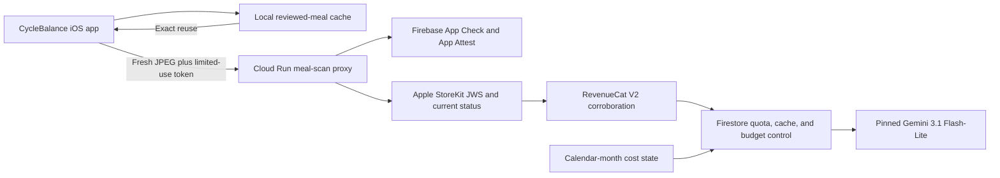

# CycleBalance Meal Scan Production Runbook

This runbook records the deployed CycleBalance meal-photo estimate architecture, its cost controls, and the remaining gates before users can access it.

## Architecture

The iOS app never calls Gemini directly. After the user chooses Photo Estimate, it normalizes one JPEG and first checks an on-device cache of previously reviewed meals. An exact local match can restore the reviewed draft without App Check, network access, quota use, or a model call. If the user chooses `Scan as New` or no exact match exists, the app requests a limited-use Firebase App Check token backed by Apple App Attest and supplies a fresh StoreKit transaction JWS. The Cloud Run proxy verifies App Check before body processing, verifies Apple transaction/current-subscription status, derives the quota principal from an HMAC of the verified original transaction ID, corroborates the current transaction through RevenueCat API v2, reuses a matching server result or consumes Firestore quota, and only then calls the pinned model. Every successful path presents one editable nutrition draft before saving reviewed values locally.



Raw photos are not retained by the proxy. Scanner metrics contain bounded operational dimensions such as provider/model, token usage, estimated cost, quota/cache decisions, rejection reason, budget mode, and latency. They do not contain a purchase principal, request ID, transaction ID, image hash, reviewed meal name, structured estimate, or raw image bytes. The `_Default` log sink excludes this service's Cloud Run HTTP request logs while retaining application and audit logs; the remaining application logs use the bucket's 30-day retention.

That proxy guarantee is not the same as provider-wide zero retention. Google states that paid Gemini prompts, contextual information, and outputs are not used to improve its products, but are normally retained for 55 days for abuse monitoring. After Google approves Zero Data Retention for a particular project, user content and identifiable metadata are cleared before abuse-monitoring logs are written. CycleBalance does not use grounding, the File API, stored Interactions, Live session resumption, or explicit context caching.

CycleBalance uses the standard paid-API disclosure: request content may be retained for up to 55 days for abuse monitoring and legal or regulatory requirements. No project-specific Zero Data Retention approval is verified, so the app, policy, App Privacy answers, and App Review notes must not claim ZDR. The implemented pre-upload confirmation names Google Gemini and waits for affirmative user action before every fresh request. Exact local repeat reuse bypasses that confirmation and makes no network request.

## Live Production Posture

As of July 13, 2026:

- Google Cloud project: `cyclebalance-prod-20260710` (`CycleBalance Production`), project number `947929010052`.
- Region: `us-central1`.
- Proxy service: `cyclebalance-meal-scan-proxy`.
- Proxy URL: `https://cyclebalance-meal-scan-proxy-mdd7lrfyqa-uc.a.run.app`.
- Proxy posture: revision `cyclebalance-meal-scan-proxy-00021-gl2` serves 100% of traffic, has private IAM, and has `MEAL_SCAN_ENABLED=false`; anonymous POST returns HTTP `403`.
- Firebase iOS app: bundle ID `alex.PCOS`, app ID `1:947929010052:ios:6e68c8645a6a6b5e3057d1`.
- App Check: App Attest provider, 3,600-second token TTL, and limited-use token replay protection.
- RevenueCat candidate contract: API v2 project `proj8da4e000`, entitlement lookup key `CycleBalance Unlimited`, and Apple product mappings `cyclebalance.premium.monthly` / `cyclebalance.premium.annual`. The code is ready, but the least-privilege production secret and deployed revision remain pending.
- Firestore: Native mode in `nam5`; quota and result-cache TTL policies are active.
- Cloud Run limits: two instances, 20 concurrent requests per instance, 30-second request timeout.
- Release app posture: Meal Scan V2, Gemini, mock, direct-provider, fallback-model, and similarity paths remain off; barcode and manual entry remain available.
- Repeat-meal posture: exact local matching is implemented independently of the model, while similarity matching remains disabled until the private labeled evaluation gate passes.

The production service is intentionally unreachable by mobile clients while disabled. When the release gates pass, it must become publicly invokable because an iOS app cannot hold a Cloud Run IAM credential. Firebase App Check, RevenueCat, quota, validation, and budget gates remain the application-layer protection.

## Model Decision

Production is pinned to `gemini-3.1-flash-lite`. The public request contract has no model selector, and production startup rejects configuration drift. The structured response is capped below 2,048 output tokens and is validated for bounded item counts, string lengths, and nutrition ranges before it can reach the app.

No fallback model or synthetic nutrition result is allowed in Release. A provider timeout after dispatch becomes an `unknown` idempotency result: the dispatch remains charged to quota and the client does not automatically issue a second paid request.

## Usage And Cost Plan

Paid access permits ten fresh provider dispatches in any rolling 24 hours and warns when two remain. Trial and sandbox access permits five fresh dispatches in a rolling 24 hours and 25 lifetime. Configuration above the immutable paid maximum of 15 fails startup. Exact local or server cache hits, barcode lookup, and manual entry do not consume quota.

At the `$20` calendar-month state, trial dispatches stop and paid access is reduced to five fresh dispatches per rolling 24 hours. At `$25`, all fresh provider dispatches stop. These controls deliberately supersede a higher nominal Cloud Billing budget: a Google Cloud budget is an alerting source, not a hard cost cap.

Run the checked-in calculator for another scenario:

```sh
node cloud/meal-scan-proxy/scripts/estimate-usage-cost.mjs \
  --users=100 \
  --scans-per-user-per-day=10 \
  --days=30
```

## Budget And Usage Safeguards

The project-scoped Cloud Billing budget is named `CycleBalance Production 100-User Scanner Budget`. Its Pub/Sub notifications feed the application controller, but the controller's calendar-month state is the enforceable scanner control. A missing, malformed, or stale state fails closed. AI Studio billing controls can lag and do not replace the Firestore budget state, quotas, or remote kill switch.

The evaluation account has a manually funded `$25` prepay balance with auto-reload off, and a Gemini 3.1 mechanics smoke test has succeeded. That proves connectivity only; it does not satisfy the locked quality benchmark or authorize production enablement.

Google Cloud budgets notify; they do not stop charges. The enforceable scanner controls are:

- `$15`: notify the owner and remain in alert mode.
- `$20`: disable trial dispatches and reduce paid access to five fresh dispatches per rolling 24 hours.
- `$25`: reject every fresh AI dispatch; cache hits, barcode lookup, and manual entry remain available.
- Trial and sandbox quota: five fresh dispatches per rolling 24 hours and 25 lifetime.
- Paid quota: warn at two remaining and stop at ten fresh dispatches per rolling 24 hours, subject to the `$20` reduction.
- Cache hit: no provider call and no additional quota consumption.
- Principal attempts: at most three per minute and 30 per rolling 24 hours.
- Global provider dispatches: at most 60 per minute and 1,000 per rolling 24 hours.
- One provider call may be in flight per quota principal.
- Remote kill switch: `mealScanControls/global` can disable the scanner independently of billing.

Gemini's exposed service quotas are tier- and model-specific request/token throughput limits, not a reliable monthly dollar cap. Do not lower an ambiguous per-minute quota as a substitute for the Firestore quotas and billing-triggered kill switch.

## Secret And IAM Rules

Only these server secrets belong in Secret Manager:

- `cyclebalance-gemini-api-key`
- `cyclebalance-revenuecat-secret-api-key`

The proxy service account receives per-secret accessor grants, not project-wide Secret Manager access. The RevenueCat API v2 key must have only `customer_information:subscriptions:read`; the production secret version has not yet been created or reviewed. The Gemini key is restricted to `generativelanguage.googleapis.com` and is sent only in the `x-goog-api-key` request header, never in a URL or log. Deployments pin numeric Secret Manager versions. Proxy, budget-controller, and build service accounts have no user-managed keys.

The app never sends a cloneable RevenueCat app-user ID to the proxy. The server verifies Apple's signed transaction and current status first, then passes only the Apple-verified transaction ID and environment to RevenueCat as secondary corroboration. The quota principal is an HMAC of the Apple original transaction ID; raw JWS values are never stored or logged.

Never place server secret values in `Info.plist`, `.xcconfig`, `.env`, source files, CI logs, or Cloud Run plain environment variables. The Firebase iOS API key and RevenueCat mobile SDK key are public client identifiers; keep their platform/API restrictions in place, but do not treat them as server credentials.

## Deploy Or Update

Bootstrap a fresh environment only when recreating the project:

```sh
cd "/Users/alexhuggler/Desktop/AI Work/PCOS/PCOS_Management/cloud/meal-scan-proxy"
PROJECT_ID="cyclebalance-prod-20260710" REGION="us-central1" ./scripts/bootstrap-gcp.sh
```

Deploy code changes in the current fail-closed posture:

```sh
cd "/Users/alexhuggler/Desktop/AI Work/PCOS/PCOS_Management/cloud/meal-scan-proxy"
PROJECT_ID="cyclebalance-prod-20260710" REGION="us-central1" ./scripts/deploy-cloud-run.sh
```

The ignored local iOS configuration must escape `//`, because xcconfig otherwise treats it as a comment:

```xcconfig
MEAL_SCAN_PROXY_BASE_URL = https:/$()/cyclebalance-meal-scan-proxy-mdd7lrfyqa-uc.a.run.app
```

Do not enable production with a console click. After all gates pass, use the reviewed deploy script so the complete environment and IAM posture are reproducible:

```sh
MEAL_SCAN_ENABLED=true \
ALLOW_UNAUTHENTICATED=true \
PROJECT_ID="cyclebalance-prod-20260710" \
REGION="us-central1" \
./scripts/deploy-cloud-run.sh
```

## Physical App Check Production Probe

The reviewed probe script is pinned to Google Cloud project `cyclebalance-prod-20260710` and Cloud Run service `cyclebalance-meal-scan-proxy`. It rejects a different `PROJECT_ID` or `SERVICE_NAME`, including in dry-run mode, so caller overrides cannot redirect the workflow. It never prints the App Check token, Google identity token, or server secrets; it builds current Release source in temporary DerivedData and never consumes a stale IPA.

Run the side-effect-free preview first from the repository root. It performs no cloud query or mutation, device query, backup, build, installation, or test:

```sh
cd "/Users/alexhuggler/Desktop/AI Work/PCOS/PCOS_Management"
DRY_RUN=true cloud/meal-scan-proxy/scripts/run-physical-app-check-probe.sh
```

Do not run the live path until the owner explicitly approves the temporary public probe and is physically controlling the iPhone. The owner must confirm all of these prerequisites immediately before execution:

- The intended iPhone is paired with this Mac, manually unlocked, in Developer Mode, and available for automatic developer disk image mounting.
- Set either `DEVICE_ID` or the legacy-compatible `DEVICE_UDID`. If both are set, they must be identical. The script accepts only an explicit current unlocked result such as `passcodeRequired=false`, `isLocked=false`, or `lockState=unlocked`; missing, unknown, locked, or conflicting JSON fails closed.
- The owner can keep the device unlocked without sharing a passcode. The script never requests or handles a passcode.
- The installed `alex.PCOS` app-data container is eligible for CoreDevice backup. A failed or empty backup is a hard stop before build, cloud mutation, or installation. Complete and verify an encrypted Finder backup before retrying.
- The dedicated `PCOS Production Meal Scan Probe` scheme is present, uses Release, includes `PCOSTests`, and is the only scheme that injects `RUN_PRODUCTION_MEAL_SCAN_INTEGRATION=1`.

Only after that approval and those checks may the owner run the live command:

```sh
cd "/Users/alexhuggler/Desktop/AI Work/PCOS/PCOS_Management"
CONFIRM_TEMPORARY_PUBLIC_PROBE=YES \
DEVICE_ID="<owner-confirmed physical-device identifier>" \
cloud/meal-scan-proxy/scripts/run-physical-app-check-probe.sh
```

Before any temporary Cloud Run change, the script verifies the pinned project/service, disabled/private service posture, normal budget mode, owner-controlled device state, non-empty app-data backup, Release bundle ID, production App Attest entitlement, and the app's proxy URL. The app URL must equal the verified Cloud Run `SERVICE_URL` exactly; only trailing slashes are ignored. The build command does not permit automatic provisioning-profile updates.

The expected negative probe result is HTTP `403` with `error=premium_entitlement_required` and `reason=storekit_transaction_invalid`. Before and after the request, evidence captures a bounded snapshot of the complete rolling-quota collection; the snapshots must be identical. Logging evidence must also show no provider call or estimate event on the probe revision, proving that neither quota consumption nor model dispatch occurred.

The rollback trap is armed immediately before the first cloud mutation and runs on success, failure, interrupt, or termination. It redeploys `MEAL_SCAN_ENABLED=false` with private IAM, then requires an unauthenticated `403` and an authenticated `503` body with `error=meal_scan_unavailable` and `reason=feature_disabled`. Any rollback deploy or verification failure is fatal and requires immediate owner investigation of the Cloud Run service.

## Release Gates

Complete in source and local verification:

- [x] Dedicated project, Cloud Billing notification path, `$15`/`$20`/`$25` application-controller states, stale-state fail-closed behavior, and remote kill switch.
- [x] Gemini Secret Manager wiring, least-privilege IAM, restricted API key, and no user-managed service-account keys.
- [x] Firebase App Check/App Attest integration and production Release source entitlement.
- [x] Apple JWS/current-status verification, HMAC principal, production/TestFlight namespace separation, and RevenueCat V2 secondary corroboration code.
- [x] Firestore rolling quota, durable `pending`/`completed`/`unknown` idempotency, request/provider ceilings, exact-result cache, and TTL handling.
- [x] Local exact-repeat reuse with no network/quota/model call, editable review, delete-all cleanup, and no backup/export serialization.
- [x] Gemini key transport moved from the URL to `x-goog-api-key`; reviewed meal names removed from public logs.
- [x] Pseudonymous user hashes removed from application logs; service HTTP request logs excluded from the default log bucket.
- [x] Rolling-only paid quota records use a short cleanup TTL; trial and sandbox lifetime counters deliberately have no TTL timestamp so the 25-lifetime maximum cannot reset after an arbitrary retention window.
- [x] Production model pin, bounded structured output, server-side image decode/re-encode, metadata stripping, size/pixel bounds, and canonical-image hashing.
- [x] Proxy tests, dependency audit, quality-toolkit tests, focused iOS tests, and disabled/private service posture.
- [x] Release target is staged as `1.0.5 (18)` with scanner feature flags off until every gate passes.

Required before enabling users:

- [ ] Acquire the ten official MFDS records using the evaluator's hidden key prompt; never place the key in chat, arguments, environment variables, source, or shell history.
- [ ] Freeze the exact 40 Nutrition5k, 30 SNAPMe, and 10 MFDS candidate before inference, then run exactly 120 calls: 80 primary plus two repeats for each of 20 locked holdouts.
- [ ] Pass every automatic quality gate: structured success at least 98%; calorie WAPE at most 25%; calorie median APE at most 20%; calorie bias from -10% through +10%; each macro WAPE at most 30%; calorie pass rate at least 70%; each macro pass rate at least 65%; source calorie WAPE at most 35%; and median holdout spread at most 10% calories and 5 g per macro.
- [ ] Complete qualitative review with at least 72 of 80 acceptable dominant-food interpretations and zero severe or uneditable failures. Any failed gate requires a newly frozen candidate and a complete 120-call rerun.
- [ ] Create and review the least-privilege RevenueCat API v2 secret, verify the live default offering/entitlement/product mappings, and validate sandbox purchase, cancellation/pending, and restore behavior without a reviewer bypass.
- [ ] Enable App Attest on the Apple App ID and regenerate the App Store distribution profile. The current profile has HealthKit and `get-task-allow=false` but lacks the production App Attest entitlement.
- [ ] Archive/export the exact candidate, confirm both required architectures, dSYM, privacy manifest, codesign/profile, production entitlements, and an exported-IPA credential scan.
- [ ] Capture six clean `1290 x 2796` screenshots per store localization from the exact submitted archive and finish the localized App Store metadata review.
- [ ] Perform the production App Check and StoreKit sandbox path on a physical iPhone, then complete the real scan/edit/save, cache/quota, purchase/restore, and kill-switch TestFlight pass for at least 24 hours.
- [ ] Configure and deploy the owner notification channel and production monitoring policies.
- [ ] Approve the public Cloud Run IAM change and production rollout.
- [ ] Approve internal TestFlight distribution and, only after the 24-hour pass with no binary or metadata changes, submission of that same build for App Review.

## Official References

- Gemini pricing: https://ai.google.dev/gemini-api/docs/pricing
- Gemini model deprecations: https://ai.google.dev/gemini-api/docs/deprecations
- Gemini API key security and migration: https://ai.google.dev/gemini-api/docs/api-key
- Gemini billing, Prepay, auto-reload, and project spend caps: https://ai.google.dev/gemini-api/docs/billing
- Gemini abuse-monitoring retention: https://ai.google.dev/gemini-api/docs/usage-policies
- Gemini Zero Data Retention: https://ai.google.dev/gemini-api/docs/zdr
- OpenAI model catalog and current Luna/Terra rates: https://developers.openai.com/api/docs/models
- Cloud Billing budgets: https://cloud.google.com/billing/docs/how-to/budgets
- Cloud Run secrets: https://cloud.google.com/run/docs/configuring/services/secrets
- Secret Manager best practices: https://cloud.google.com/secret-manager/docs/best-practices
- Firebase App Check with App Attest: https://firebase.google.com/docs/app-check/ios/app-attest-provider
- Firebase custom backend verification: https://firebase.google.com/docs/app-check/custom-resource-backend
- RevenueCat API V2: https://www.revenuecat.com/docs/api-v2
- RevenueCat authentication: https://www.revenuecat.com/docs/projects/authentication
- OpenAI GPT-5.6 Luna: https://developers.openai.com/api/docs/models/gpt-5.6-luna
- OpenAI GPT-5.6 Terra: https://developers.openai.com/api/docs/models/gpt-5.6-terra
