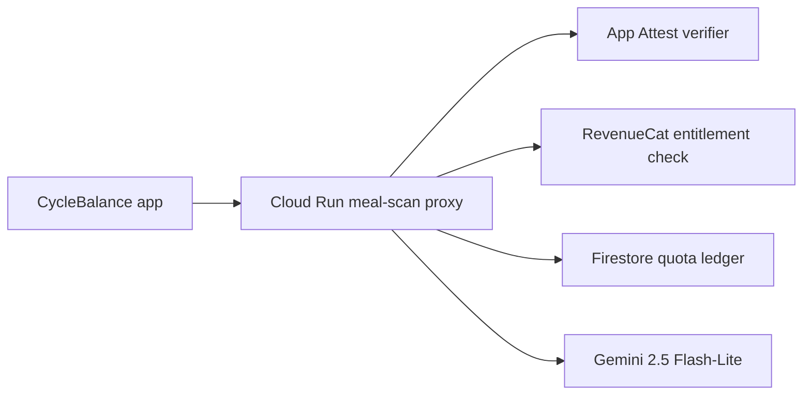

# CycleBalance Gemini Flash-Lite Production Setup

This runbook is for turning the CycleBalance meal photo estimate flow into a production-gated cloud feature without putting API keys in the iOS app.

## Plain-English Architecture

The iPhone app never calls Gemini directly. It sends a normalized JPEG to the CycleBalance meal-scan proxy. The proxy checks app integrity, RevenueCat access, and quota first. Only then does the proxy call `gemini-2.5-flash-lite` with the server-side Gemini key.



## What Is Already In The Repo

- iOS reads `MEAL_SCAN_PROXY_BASE_URL` from `Info.plist`.
- The default iOS remote model is `gemini-2.5-flash-lite`.
- The proxy default model is `gemini-2.5-flash-lite`.
- The proxy enforces RevenueCat access before Gemini calls.
- The proxy can use Firestore for quota when `MEAL_SCAN_QUOTA_STORE=firestore`.
- The proxy supports monthly budget modes: alert, degrade to Lite-only, and disable.
- The app keeps remote scanner feature flags off by default until explicitly enabled.

## What You Need To Create Or Log Into

1. Google Cloud project for CycleBalance.
2. Billing enabled on that Google Cloud project.
3. Gemini API key created for that project.
4. RevenueCat secret API key.
5. Firestore enabled in Native mode.
6. Cloud Run enabled for the proxy.
7. App Attest verification path:
   - Preferred production path: Firebase App Check with App Attest, or a vetted Apple App Attest verifier service.
   - Do not broad-release with `APP_ATTEST_ACCEPT_UNVERIFIED_ASSERTIONS=true`.

## Safe Secret Storage

Use Google Secret Manager for server secrets:

- `cyclebalance-gemini-api-key`
- `cyclebalance-revenuecat-secret-api-key`
- `cyclebalance-app-attest-verifier-bearer`

Do not put these values in:

- `Info.plist`
- `.xcconfig`
- `.env`
- GitHub Actions logs
- Cloud Run plain environment variables
- source files

`REVENUECAT_PUBLIC_SDK_KEY` is allowed in the app because it is a public mobile SDK key. The RevenueCat secret API key is not allowed in the app.

## Bootstrap Commands

Install and log into the Google Cloud SDK first:

```sh
brew install --cask google-cloud-sdk
gcloud auth login
gcloud auth application-default login
```

Then run:

```sh
cd "/Users/alexhuggler/Desktop/AI Work/PCOS/PCOS_Management/cloud/meal-scan-proxy"
PROJECT_ID="your-cyclebalance-project-id" REGION="us-central1" ./scripts/bootstrap-gcp.sh
```

The bootstrap script enables Cloud Run, Cloud Build, Artifact Registry, Secret Manager, Firestore, and Gemini API access. It creates the Cloud Run service account, creates Firestore if needed, and stores secrets through hidden prompts.

## Deploy The Proxy

Initial deploy should stay disabled:

```sh
cd "/Users/alexhuggler/Desktop/AI Work/PCOS/PCOS_Management/cloud/meal-scan-proxy"
PROJECT_ID="your-cyclebalance-project-id" REGION="us-central1" ./scripts/deploy-cloud-run.sh
```

The deploy script sets `MEAL_SCAN_ENABLED=false` on purpose. This lets us verify the service, secrets, and logging before user scans can spend money.

For app-based staging after App Attest verification exists, redeploy with:

```sh
ALLOW_UNAUTHENTICATED=true PROJECT_ID="your-cyclebalance-project-id" REGION="us-central1" ./scripts/deploy-cloud-run.sh
```

Cloud Run must be unauthenticated for the mobile app to reach it directly. The real protection is the app-level gate: App Attest, RevenueCat entitlement checks, Firestore quota, and the kill switch.

## iOS Build Setting

After deployment, put only the proxy URL in local config:

```xcconfig
MEAL_SCAN_PROXY_BASE_URL = https://your-cloud-run-url.run.app
```

Keep this in `Config/LocalSecrets.xcconfig`, which is ignored by git.

## Quota Defaults

- Trial: 5 scans/day and 25 scans total during trial.
- Paid: 5/day soft warning and 10/day hard cap.
- Manual meal logging and barcode lookup remain unlimited.

If we intentionally allow 100 people to scan 15 times/day:

| Scenario | Scans/day | 30-day scans | Estimated 30-day Gemini cost |
|---|---:|---:|---:|
| Lower Lite estimate at `$0.0002/scan` | 1,500 | 45,000 | `$9.00` |
| Current proxy sample Lite estimate at `$0.0005448/scan` | 1,500 | 45,000 | `$24.52` |
| Upper Flash/escalation estimate at `$0.001/scan` | 1,500 | 45,000 | `$45.00` |

With the current paid hard cap of 10/day, 100 paid users would cap at 1,000 scans/day:

| Scenario | Scans/day | 30-day scans | Estimated 30-day Gemini cost |
|---|---:|---:|---:|
| Lower Lite estimate at `$0.0002/scan` | 1,000 | 30,000 | `$6.00` |
| Current proxy sample Lite estimate at `$0.0005448/scan` | 1,000 | 30,000 | `$16.34` |
| Upper Flash/escalation estimate at `$0.001/scan` | 1,000 | 30,000 | `$30.00` |

Use the calculator for other cases:

```sh
node cloud/meal-scan-proxy/scripts/estimate-usage-cost.mjs --users=100 --scans-per-user-per-day=15 --days=30
```

## Release Gates Before `MEAL_SCAN_ENABLED=true`

- `GEMINI_API_KEY` is in Secret Manager.
- `REVENUECAT_SECRET_API_KEY` is in Secret Manager.
- Firestore quota store is enabled with `MEAL_SCAN_QUOTA_STORE=firestore`.
- `APP_ATTEST_REQUIRED=true`.
- App Attest verifier is deployed and receiving requests.
- `MEAL_SCAN_ENABLED=false` has been smoke-tested.
- 50-100 real meal photos have been tested in staging.
- App Privacy, privacy policy, and review notes disclose user-initiated photo analysis.
- Budget thresholds remain set:
  - `$50/month` alert
  - `$75/month` degrade
  - `$100/month` disable

## Official Setup References

- Gemini API keys: https://ai.google.dev/gemini-api/docs/api-key
- Gemini pricing: https://ai.google.dev/gemini-api/docs/pricing
- Cloud Run secrets: https://cloud.google.com/run/docs/configuring/services/secrets
- Firestore: https://cloud.google.com/firestore/docs
- Firebase App Check with App Attest: https://firebase.google.com/docs/app-check/ios/app-attest-provider
- RevenueCat secret API keys: https://www.revenuecat.com/docs/projects/authentication
