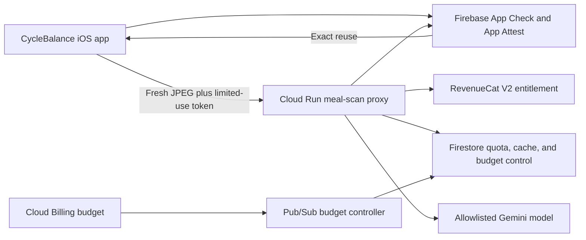

# CycleBalance Meal Scan Production Runbook

This runbook records the deployed CycleBalance meal-photo estimate architecture, its cost controls, and the remaining gates before users can access it.

## Architecture

The iOS app never calls Gemini directly. After the user chooses Photo Estimate, it normalizes one JPEG and first checks an on-device cache of previously reviewed meals. An exact local match can restore the reviewed draft without App Check, network access, quota use, or a model call. If the user chooses `Scan as New` or no exact match exists, the app requests a limited-use Firebase App Check token backed by Apple App Attest. The Cloud Run proxy verifies the token and app ID, checks the fail-closed budget and global request controls, checks RevenueCat access, reuses a matching server result or consumes Firestore quota, and only then calls an allowlisted model. Every path presents one editable nutrition draft before saving reviewed values locally.


```mermaid
flowchart LR
    A["CycleBalance iOS app"] --> C["Local reviewed-meal cache"]
    C -->|"Exact reuse"| A
    A -->|"Fresh JPEG plus limited-use token"| B["Cloud Run meal-scan proxy"]
    B --> C["Firebase App Check and App Attest"]
    B --> D["RevenueCat V2 entitlement"]
    B --> E["Firestore quota, cache, and budget control"]
    B --> F["Allowlisted Gemini model"]
    G["Cloud Billing budget"] --> H["Pub/Sub budget controller"]
    H --> E
```

Raw photos are not retained by the proxy. Application logs contain an image-hash prefix, provider/model metadata, token usage, estimated cost, quota tier, budget mode, and status metadata. Pseudonymous app user hashes, reviewed meal names, and raw image bytes are not written to application logs. The `_Default` log sink excludes this service's Cloud Run HTTP request logs while retaining application and audit logs; the remaining application logs use the bucket's 30-day retention.

That proxy guarantee is not the same as provider-wide zero retention. Under Google's standard paid-API posture, request content may be retained for up to 55 days. CycleBalance does not use grounding, the File API, stored Interactions, Live session resumption, or explicit context caching. There is no verified project-specific Zero Data Retention approval or evidence that a ZDR request was submitted for `cyclebalance-prod-20260710`.

Before enabling fresh uploads, disclose the standard paid-API posture consistently in the app, privacy policy, App Privacy answers, and App Review notes: request content may be retained for up to 55 days. A future project-specific ZDR claim requires separately verified approval evidence.

The pre-upload confirmation names Google Gemini and waits for affirmative user action. The app pauses every fresh photo at that confirmation, offers manual entry and retake alternatives, and sends nothing until the user continues. Exact local repeat reuse bypasses the remote-upload confirmation and makes no network request.

## Live Production Posture

As of July 13, 2026:

- Google Cloud project: `cyclebalance-prod-20260710` (`CycleBalance Production`), project number `947929010052`.
- Region: `us-central1`.
- Proxy service: `cyclebalance-meal-scan-proxy`.
- Proxy URL: `https://cyclebalance-meal-scan-proxy-mdd7lrfyqa-uc.a.run.app`.
- Proxy posture: private IAM and `MEAL_SCAN_ENABLED=false`; rollback revision `cyclebalance-meal-scan-proxy-00021-gl2` serves 100% of traffic. An exact unauthenticated POST returns HTTP `403` at the IAM boundary, while an authenticated POST returns the exact `503 feature_disabled` body.
- Firebase iOS app: bundle ID `alex.PCOS`, app ID `1:947929010052:ios:6e68c8645a6a6b5e3057d1`.
- App Check: App Attest provider, 3,600-second token TTL, and limited-use token replay protection.
- RevenueCat: API V2 project `proj8da4e000`, entitlement `CycleBalance Unlimited`.
- Firestore: Native mode in `nam5`; quota, request-gate, and result-cache TTL policies are active. The pre-entitlement abuse ledger uses the dedicated `mealScanRequestGate` collection, isolated from billable scan quota in `mealScanDailyQuota`. The `cloud.firestore` Firebase Rules release denies every mobile/web operation, while the Cloud Run server client uses least-privilege IAM. A 30/minute and 200/day per-ID request gate plus a 300/minute and 3,000/day global gate covers cache hits and failed entitlement checks. A 30-second cross-instance cache lease collapses concurrent identical estimates inside the normal provider deadline.
- Cloud Run limits: two instances, 20 concurrent requests per instance, 30-second request timeout.
- Release app posture: Meal Scan V2, Gemini, mock data, and meal-photo retention remain off; barcode and manual entry remain available.
- Repeat-meal posture: exact local matching is implemented independently of the model. Similarity matching remains disabled until the private 100-image evaluation set passes the approved policy gate.
- Consent posture: every fresh upload requires an affirmative Google Gemini confirmation; barcode, manual entry, retake, and exact local reuse remain available without an upload.
- Gemini billing posture: `$25` Prepay balance purchased, auto-reload off, exact-project spend cap `$120`, and successful service-account-bound authorization-key smoke against `gemini-3.1-flash-lite`.
- Gemini data posture: use the standard paid-API disclosure that request content may be retained for up to 55 days. No project-specific ZDR approval or request submission is verified.

The physical side-effect gate is complete. An initial July 13 run against temporary revision `cyclebalance-meal-scan-proxy-00017-4rm` proved production App Attest and exposed that the pre-entitlement abuse ledger shared a Firestore document with billable quota. After isolating the ledgers and conditionally deleting the two probe-only legacy records, the corrected run on `General Kenobi` against temporary revision `cyclebalance-meal-scan-proxy-00020-lqb` passed the dedicated Release test, advanced only `mealScanRequestGate`, left the billable probe quota absent, and emitted no Gemini estimate. Private/disabled rollback revision `cyclebalance-meal-scan-proxy-00021-gl2` and restoration of the phone's initially absent app state were independently verified.

The production service is intentionally unreachable by mobile clients while disabled. When the release gates pass, it must become publicly invokable because an iOS app cannot hold a Cloud Run IAM credential. Firebase App Check, RevenueCat, quota, validation, and budget gates remain the application-layer protection.

## Model Decision

Use `gemini-3.1-flash-lite` as the production candidate and default. It is the least-expensive compatible model that the paid production project can call successfully, accepts image input, supports structured output, and is stable. Keep `gemini-2.5-flash` allowlisted only for controlled quality escalation; never select it automatically while the budget is degraded.

- Do not use `gemini-2.0-flash-lite`; Google shut it down on June 1, 2026.
- The paid production project returns `404 NOT_FOUND` for `gemini-2.5-flash-lite` because it is unavailable to new users, so it cannot be a launch fallback.
- Gemini 3.1 Flash-Lite supports image input and structured output and returned a valid production-key response using the real scanner schema and prompt.
- OpenAI GPT-5.6 Luna and Terra support image input and structured output, but at the measured payload their published token rates are about 4x and 10x Gemini 3.1 Flash-Lite. No published meal-nutrition benchmark currently demonstrates enough quality gain to justify adding a second provider.

Measured mechanics/cost smoke: 1,184 input tokens and 189 output tokens using one non-private app asset and the production scanner prompt/schema. This proves request compatibility and provides a cost baseline; it is not food-recognition quality evidence.

| Model | Input / output per 1M tokens | Model cost per measured scan | Relative to Gemini 3.1 |
|---|---:|---:|---:|
| Gemini 3.1 Flash-Lite | `$0.25 / $1.50` | `$0.0005795` | `1.00x` |
| OpenAI GPT-5.6 Luna | `$1.00 / $6.00` | `$0.0023180` | `4.00x` |
| OpenAI GPT-5.6 Terra | `$2.50 / $15.00` | `$0.0057950` | `10.00x` |

### Public Quality Benchmark

The owner has no private meal-photo set, so the first quality gate uses an 80-image public benchmark and keeps each source scored separately:

- 40 Nutrition5k test-split dishes with weighed ingredients, grams, calories, and macros under CC BY 4.0.
- 30 USDA/UC Davis SNAPMe non-packaged before-meal phone photos linked to checked ASA24 nutrition records under CC BY-SA 4.0.
- 10 Korea MFDS recipe images with complete one-serving quantities and nutrition records, reported as a separate cuisine-diversity slice.
- Freeze source URL, license, image hash, ground truth, reference type, and sampling reason in the manifest. Hold back 20 images as a locked prompt-regression set.

Use the exact production normalization, prompt, schema, and model. Require at least 98% valid structured responses; calorie WAPE at or below 25%, median calorie percentage error at or below 20%, signed calorie bias within 10%, each macro WAPE at or below 30%, calorie pass rate at least 70%, and each macro pass rate at least 65%. No Nutrition5k or SNAPMe stratum may exceed 35% calorie WAPE. Public data can be present in model training, so this is a reproducible quality floor, not proof of blind real-user generalization.

The checked-in toolkit at `tools/meal-scan-quality-evaluation` now prepares a private normalized-image bundle, assigns a deterministic source-balanced 20-image holdout, verifies the production service remains private and disabled, reads the pinned Gemini key from Secret Manager without printing it, executes exactly 80 primary and 40 stability calls sequentially with the production prompt/schema/model, and scores each source plus the combined set. It emits aggregate metrics and opaque IDs only. Dataset acquisition is always an explicit operator action: the Nutrition5k helper pins the official split/metadata hashes and downloads only 40 overhead test PNGs; the SNAPMe helper streams and MD5-verifies the official 2.03 GB archive without retaining it, then writes only the selected 30 public JPEGs and a participant-free source-index fragment. The MFDS helper requests the Food Safety Korea key through a hidden terminal prompt, never persists it, validates bounded official API responses and allowlisted HTTPS images, and writes only ten deterministic public recipe records. Passing toolkit tests are not quality evidence. Replace the synthetic sample manifest only after every selected source record and license is verified, then follow the toolkit README.

```sh
cd tools/meal-scan-quality-evaluation
python3 scripts/acquire_nutrition5k.py --output-dir /absolute/private/public-datasets/nutrition5k
python3 scripts/acquire_snapme.py --output-dir /absolute/private/public-datasets/snapme
python3 scripts/acquire_mfds.py --output-dir /absolute/private/public-datasets/mfds
node score.mjs --manifest manifest.private.json --results results.jsonl --stability stability-results.jsonl > report.json
```

## 100-User Cost Plan

The launch quota remains a five-scan soft warning and ten-scan daily hard cap for paid users. The 15-scan scenario below is a stress forecast for deciding whether to raise that cap later; it is not reachable under the launch policy. Keep the ten-scan cap during limited production. At the conservative high planning rate, 100 users at 15 scans/day would cost about `$135/month`, so the proxy's `$120` stop would engage before the scenario completed and preserve the Cloud budget buffer.

| Model or planning range | 100 users at 10/day (30,000/month) | 100 users at 15/day (45,000/month) |
|---|---:|---:|
| Gemini 3.1 Flash-Lite, measured model-only baseline | `$17.39` | `$26.08` |
| OpenAI GPT-5.6 Luna, same-token model-only comparison | `$69.54` | `$104.31` |
| OpenAI GPT-5.6 Terra, same-token model-only comparison | `$173.85` | `$260.77` |
| Gemini 3.1 all-in planning range at `$0.001-$0.003/scan` | `$30-$90` | `$45-$135` |

At 25 trial scans, the measured Gemini 3.1 token baseline is about `$0.0145` per trial user; use `$0.025-$0.075` as the all-in planning range. A paid user at 10 scans/day is about `$0.30-$0.90/month`; 15 scans/day would be about `$0.45-$1.35/month`. Barcode and manual logging do not call the model and remain unlimited.

Run the checked-in calculator for another scenario:

```sh
node cloud/meal-scan-proxy/scripts/estimate-usage-cost.mjs \
  --users=100 \
  --scans-per-user-per-day=15 \
  --days=30
```

## Budget And Usage Safeguards

The project-scoped Cloud Billing budget is named `CycleBalance Production 100-User Scanner Budget` and is set to `$150/month`. It sends actual-spend notifications at 50%, 75%, 90%, and 100%, plus a forecast notification at 100%.

Gemini API billing is a separate control plane from the Google Cloud welcome-credit balance. On July 12, 2026, CycleBalance purchased exactly `$25` of Gemini Prepay, left auto-reload off, and set the exact production project's AI Studio spend cap to `$120`. The production Secret Manager key then completed a successful header-auth `gemini-3.1-flash-lite` generation smoke. The same key receives `404 NOT_FOUND` for `gemini-2.5-flash-lite`, confirming that model is unavailable to this new project.

Use this staged funding posture:

- Evaluation: the approved `$25` manual Prepay purchase is complete and auto-reload remains off.
- Limited production: set the AI Studio project spend cap for `cyclebalance-prod-20260710` to `$120` and keep the proxy's independent `$120` stop.
- Optional auto-reload: use small reload increments and set AI Studio's monthly auto-charge limit to no more than `$150`; do not enable it without separate owner approval.
- Reconcile project identity after billing changes. AI Studio billing tier and credits are determined at the billing-account level, but the production API key and project spend cap must still remain associated with `CycleBalance Production (cyclebalance-prod-20260710)`.

AI Studio project spend caps and Prepay balance enforcement can lag, so neither replaces the proxy quota, budget-control document, or remote kill switch.

Google Cloud budgets notify; they do not stop charges. The enforceable scanner controls are:

- `$75`: proxy reports alert mode.
- `$90`: proxy enters degraded mode and forces the least expensive allowlisted model.
- `$120`: after integrity verification, the proxy rejects scans before RevenueCat, quota, or Gemini calls. A stale manual `normal` mode cannot override a stricter billing mode.
- `$30`: reserved budget buffer after scanner disablement for notification latency and non-scanner project costs.
- Trial quota: 5 scans/day and 25 scans total.
- Paid quota: warning at 5/day and hard stop at 10/day.
- Cache hit: no model call and no additional scan consumption.
- Request gate: 30 integrity-verified requests/minute and 200/day per submitted app-user ID, plus 300/minute and 3,000/day globally, before RevenueCat, cache, or model work. Rejected requests do not create additional Firestore writes.
- Single-flight lease: a 30-second lease collapses simultaneous identical image/model/schema/prompt/meal-type/locale requests inside the 12-second provider deadline. It is best-effort cost control, not an exactly-once promise after infrastructure timeouts.
- Capacity limit: at most 40 concurrent proxy requests across two instances.
- Remote kill switch: `mealScanControls/global` can disable the scanner independently of billing.

Gemini's exposed service quotas are tier- and model-specific request/token throughput limits, not a reliable monthly dollar cap. Do not lower an ambiguous per-minute quota as a substitute for the Firestore quotas and billing-triggered kill switch.

## Secret And IAM Rules

Only these server secrets belong in Secret Manager:

- `cyclebalance-gemini-api-key`
- `cyclebalance-revenuecat-secret-api-key`

The proxy service account receives per-secret accessor grants, not project-wide Secret Manager access. The RevenueCat key is limited to read-only Customers and Subscriptions. The Gemini key is restricted to `generativelanguage.googleapis.com` and is sent only in the `x-goog-api-key` request header, never in a URL or log. Proxy, budget-controller, and build service accounts have no user-managed keys.

The active Gemini key is an authorization key bound to `cyclebalance-meal-scan-proxy@cyclebalance-prod-20260710.iam.gserviceaccount.com`, restricted to the Generative Language API, and stored as Secret Manager version 2. The deployed Cloud Run service references that explicit version. The superseded standard key is deleted and Secret Manager version 1 is disabled. Do not expose the active key to the iOS target.

The repository `firestore.rules` file denies all mobile/web reads and writes. `scripts/deploy-firestore-rules.sh` is pinned to the production project, uses a short-lived Google OAuth token through a mode-600 curl config, creates a validated immutable ruleset, and reads the release and source back after deployment. Every `deploy-cloud-run.sh` execution runs this rules deployment and verification before changing Cloud Run, so a public scanner revision cannot be deployed through the reviewed path with stale client rules. Google Cloud Firestore server libraries bypass Firebase Rules and are authorized by IAM, so the proxy retains access through its `roles/datastore.user` grant without opening any client path.

Anonymous RevenueCat app user IDs are identifiers, not bearer secrets or signed receipts. For this limited rollout, every request still needs a valid limited-use App Check token and a currently entitled RevenueCat record, and copied IDs share the same 10-scan daily quota. That bounds cost but does not cryptographically bind the purchase to one installation. Before materially raising limits or broadening rollout, require server-verified StoreKit transaction JWS evidence or a direct App Attest installation binding. RevenueCat Trusted Entitlements remains useful against response tampering but does not prevent app-user-ID sharing.

Never place server secret values in `Info.plist`, `.xcconfig`, `.env`, source files, CI logs, or Cloud Run plain environment variables. The Firebase iOS API key and RevenueCat mobile SDK key are public client identifiers; keep their platform/API restrictions in place, but do not treat them as server credentials.

## Deploy Or Update

Bootstrap a fresh environment only when recreating the project:

```sh
cd "/Users/alexhuggler/Desktop/AI Work/PCOS/PCOS_Management/cloud/meal-scan-proxy"
PROJECT_ID="cyclebalance-prod-20260710" REGION="us-central1" ./scripts/bootstrap-gcp.sh
```

Deploy code changes in the current fail-closed posture:

```sh
cd "/Users/alexhuggler/Desktop/AI Work/PCOS/PCOS_Management/cloud/meal-scan-proxy"
PROJECT_ID="cyclebalance-prod-20260710" REGION="us-central1" ./scripts/deploy-cloud-run.sh
```

The ignored local iOS configuration must escape `//`, because xcconfig otherwise treats it as a comment:

```xcconfig
MEAL_SCAN_PROXY_BASE_URL = https:/$()/cyclebalance-meal-scan-proxy-mdd7lrfyqa-uc.a.run.app
```

Do not enable production with a console click. After all gates pass, use the reviewed deploy script so the complete environment and IAM posture are reproducible:

```sh
MEAL_SCAN_ENABLED=true \
ALLOW_UNAUTHENTICATED=true \
PROJECT_ID="cyclebalance-prod-20260710" \
REGION="us-central1" \
./scripts/deploy-cloud-run.sh
```

## Physical App Check Production Probe

The reviewed probe script is pinned to Google Cloud project `cyclebalance-prod-20260710` and Cloud Run service `cyclebalance-meal-scan-proxy`. It rejects a different `PROJECT_ID` or `SERVICE_NAME`, including in dry-run mode, so caller overrides cannot redirect the workflow. It never prints the App Check token, Google identity token, or server secrets; it builds current Release source in temporary DerivedData and never consumes a stale IPA.

Run the side-effect-free preview first from the repository root. It performs no cloud query or mutation, device query, backup, build, installation, or test:

```sh
cd "/Users/alexhuggler/Desktop/AI Work/PCOS/PCOS_Management"
DRY_RUN=true cloud/meal-scan-proxy/scripts/run-physical-app-check-probe.sh
```

Do not run the live path until the owner explicitly approves the temporary public probe and is physically controlling the iPhone. The owner must confirm all of these prerequisites immediately before execution:

- The intended iPhone is paired with this Mac, manually unlocked, in Developer Mode, and available for automatic developer disk image mounting.
- Set either `DEVICE_ID` or the legacy-compatible `DEVICE_UDID` to the CoreDevice `Identifier` printed by `xcrun devicectl list devices`. Do not use the separate hardware UDID printed by `xcodebuild -showdestinations`; the script resolves that Xcode destination itself by the exact paired device name. If both variables are set, they must be identical. The script accepts only an explicit current unlocked result such as `passcodeRequired=false`, `isLocked=false`, or `lockState=unlocked`; missing, unknown, locked, or conflicting JSON fails closed.
- The owner can keep the device unlocked without sharing a passcode. The script never requests or handles a passcode.
- CoreDevice can return a successful, well-formed installed-app inventory. If `alex.PCOS` is present, its app-data container must be eligible for backup; a failed or empty backup is a hard stop before build, cloud mutation, or installation. If a valid inventory proves the app is absent, the script records that result and safely skips backup.
- The dedicated `PCOS Production Meal Scan Probe` scheme is present, uses Release, includes only `PCOSProductionProbeTests`, and is the only scheme that injects `RUN_PRODUCTION_MEAL_SCAN_INTEGRATION=1`.

Only after that approval and those checks may the owner run the live command:

```sh
cd "/Users/alexhuggler/Desktop/AI Work/PCOS/PCOS_Management"
CONFIRM_TEMPORARY_PUBLIC_PROBE=YES \
DEVICE_ID="<owner-confirmed physical-device identifier>" \
cloud/meal-scan-proxy/scripts/run-physical-app-check-probe.sh
```

Before any temporary Cloud Run change, the script verifies the pinned project/service, disabled/private service posture, normal budget mode, owner-controlled device state, a valid app inventory, any required non-empty app-data backup, Release bundle ID, signed production App Attest entitlement, and the app's proxy URL. The signed entitlement is extracted as XML from the built app instead of inferred from source configuration. The app URL must equal the verified Cloud Run `SERVICE_URL` exactly; only trailing slashes are ignored. The build command does not permit automatic provisioning-profile updates.

The expected probe result is HTTP `403` with `error=premium_entitlement_required` and `reason=entitlement_inactive`. The integrity-verified request intentionally increments the short-lived user and global abuse ledgers in `mealScanRequestGate` before RevenueCat. The script requires both request-gate snapshots to advance by exactly one, proving the request passed App Check and reached the isolated pre-entitlement gate. Before and after the request, evidence separately captures the billable `mealScanDailyQuota` document's existence, update time, and complete data; those snapshots must be identical. After a short log-ingestion wait, the probe revision must contain no `meal_scan_estimate` event. The test writes an `.xcresult`; on failure, the result bundle and redacted console log are retained under `~/Library/Logs/CycleBalance/PhysicalProbe/<UTC timestamp>-failed` with owner-only directory permissions.

The rollback trap is armed immediately before the first cloud mutation and runs on success, failure, interrupt, or termination. It redeploys `MEAL_SCAN_ENABLED=false` with private IAM, allows up to three minutes for IAM propagation, then requires an unauthenticated `403` and an authenticated `503` body with `error=meal_scan_unavailable` and `reason=feature_disabled`. If CycleBalance was absent before testing, the trap removes the transient probe app and verifies that the original absence is restored. Any rollback deploy or verification failure is fatal and requires immediate owner investigation of the Cloud Run service.

Production evidence captured on July 13, 2026: a signed Release build ran the dedicated test once with zero XCTest failures on `General Kenobi` against temporary enabled revision `cyclebalance-meal-scan-proxy-00020-lqb`. The user and global `mealScanRequestGate` records were both created at `2026-07-13T05:24:20.309744Z` with request count `1`, which can occur only after Firebase App Check succeeds. The billable probe quota document remained absent, and the temporary revision emitted no `meal_scan_estimate` event. The then-current harness did not surface the safe hash print in `xcodebuild` output and its 60-second private-IAM wait expired shortly before propagation completed, so it exited nonzero after the successful test. Independent readback confirmed rollback revision `cyclebalance-meal-scan-proxy-00021-gl2` at 100% traffic, `MEAL_SCAN_ENABLED=false`, no `allUsers` IAM binding, anonymous POST `403`, authenticated POST `503 feature_disabled`, and removal of the transient `alex.PCOS` app. The harness now uses request-gate advancement instead of console text, retains failure diagnostics, and waits up to three minutes for IAM propagation.

## Release Gates

Complete now:

- [x] Dedicated project, linked Cloud Billing account, `$150` Cloud budget, Pub/Sub controller, and hard proxy disable threshold.
- [x] Secret Manager, least-privilege IAM, restricted API keys, and no user-managed service-account keys.
- [x] Firebase App Check/App Attest integration and production Release entitlement.
- [x] RevenueCat V2 entitlement/trial lookup.
- [x] Firestore quota, isolated pre-entitlement request gate, dedupe cache, TTL, and remote kill switch.
- [x] Deny-all Firebase Rules deployed and read back for the production `cloud.firestore` release; Cloud Run remains IAM-authorized.
- [x] Local exact-repeat reuse with no network/quota/model call, editable review, delete-all cleanup, and no backup/export serialization.
- [x] Gemini key transport moved from the URL to `x-goog-api-key`; reviewed meal names removed from public logs.
- [x] Pseudonymous user hashes removed from application logs; service HTTP request logs excluded from the default log bucket.
- [x] Firestore request-gate and quota expirations use timestamp-compatible values so active TTL policies can delete short-lived abuse and daily records after three days and trial totals after thirty days.
- [x] Trial-total expiry is fixed when the record is created; rejected retries do not extend the thirty-day retention window.
- [x] Production App Check rejects missing tokens before body parsing; per-ID and global request gates run before RevenueCat, budget modes combine fail-closed, invalid numeric limits prevent enabled startup, cache identity includes all prompt context, and concurrent duplicates use a bounded Firestore lease.
- [x] Proxy tests, dependency audit, disabled-service smoke test, focused iOS tests, and signed Release build.
- [x] Fresh-photo consent names Google Gemini, requires affirmative action, and preserves barcode, manual, retake, and exact local-reuse alternatives.
- [x] Scanner entry and onboarding copy are consolidated around `Add Nutrition` and `Photo Estimate`; stale coming-soon cards are removed and the action hides cleanly while disabled.
- [x] Exact-project Gemini Prepay funded with `$25`, auto-reload off, `$120` AI Studio spend cap configured, storage disabled for GenerateContent and Interactions, and 3.1 header-auth smoke successful.
- [x] Gemini authentication migrated to a service-account-bound authorization key, deployed from Secret Manager version 2, smoke-tested, and the superseded standard key retired.
- [x] Acquire and verify the 40-image Nutrition5k slice without the 181.4 GB archive. The three official split/metadata SHA-256 pins, 40 owner-only depth-test PNGs, and per-image provenance hashes passed; 16 MB was retained.
- [x] Acquire and verify the 30-image SNAPMe slice through a one-pass 2,034,227,035-byte stream. The pinned archive MD5, exact 7/8/8/7 meal-type split, 30 regular owner-only images, and participant-free source fragment all passed local validation; only 6.7 MB was retained.
- [x] Complete the production physical App Attest side-effect probe on `General Kenobi` against the isolated request-gate implementation, with expected entitlement rejection, no billable quota, no Gemini estimate, verified private/disabled rollback, and restoration of the initially absent app state.

Required before enabling users:

- [x] Adopt the standard Google paid-API disclosure that request content may be retained for up to 55 days. No project-specific ZDR approval or request submission is verified; do not claim ZDR unless evidence is obtained later.
- [ ] Run the documented 80-image public Nutrition5k/SNAPMe/MFDS benchmark and meet every structured-output, calorie, macro, bias, stratum, and stability gate. The private preparation/paid-run/scoring workflow is implemented and tested, and Nutrition5k plus SNAPMe are acquired; the keyed MFDS slice, bundle preparation, and model results remain outstanding.
- [ ] Run the private repeat-meal evaluation toolkit with exactly 100 images: 20 meal identities with four unchanged-portion views each and 20 visually similar negatives. Strip EXIF, exclude faces/documents/medication labels/location-revealing backgrounds, and keep macro truth outside the image manifest. Do not install a repeat-similarity policy unless the calibrator reports precision at least `0.95` and zero high-risk false matches; the five-image extractor smoke run is mechanics-only evidence and does not satisfy this gate. See `tools/meal-repeat-evaluation/README.md`.
- [ ] Complete a labeled food-quality evaluation of Gemini 3.1 before enabling users. Model availability, schema compatibility, and cost selection are complete; the non-private mechanics smoke is not nutrition-quality evidence.
- [x] Verify the privacy, terms, and support pages are live and current. The Privacy Policy carries the standard 55-day disclosure, the Terms and Support FAQ describe remote Photo Estimate processing, and support was published in commit `e119045`.
- [ ] Update App Privacy and capture final consent/App Review screenshots using the standard disclosure that request content may be retained for up to 55 days. Neither submission item is complete.
- [ ] Increment `CURRENT_PROJECT_VERSION` above build `17` before uploading any binary that contains the production scanner client.
- [ ] Re-run the proxy, iOS, archive, and end-to-end smoke checks with the production feature flags enabled.
- [ ] Approve the public Cloud Run IAM change and production rollout.
- [ ] Before materially raising scanner quotas or broadening beyond the limited rollout, cryptographically bind entitlement access with server-verified StoreKit transaction JWS evidence or direct App Attest installation identity.

## Official References

- Gemini pricing: https://ai.google.dev/gemini-api/docs/pricing
- Gemini model deprecations: https://ai.google.dev/gemini-api/docs/deprecations
- Gemini API key security and migration: https://ai.google.dev/gemini-api/docs/api-key
- Gemini billing, Prepay, auto-reload, and project spend caps: https://ai.google.dev/gemini-api/docs/billing
- Gemini abuse-monitoring retention: https://ai.google.dev/gemini-api/docs/usage-policies
- Gemini Zero Data Retention: https://ai.google.dev/gemini-api/docs/zdr
- OpenAI model catalog and current Luna/Terra rates: https://developers.openai.com/api/docs/models
- Cloud Billing budgets: https://cloud.google.com/billing/docs/how-to/budgets
- Cloud Run secrets: https://cloud.google.com/run/docs/configuring/services/secrets
- Secret Manager best practices: https://cloud.google.com/secret-manager/docs/best-practices
- Firebase App Check with App Attest: https://firebase.google.com/docs/app-check/ios/app-attest-provider
- Firebase custom backend verification: https://firebase.google.com/docs/app-check/custom-resource-backend
- Firebase Rules management: https://firebase.google.com/docs/rules/manage-deploy
- Firestore server IAM and Rules bypass: https://cloud.google.com/firestore/docs/security/iam
- Apple StoreKit signed transactions: https://developer.apple.com/documentation/storekit/transaction
- RevenueCat API V2: https://www.revenuecat.com/docs/api-v2
- Nutrition5k public benchmark: https://github.com/google-research-datasets/Nutrition5k
- USDA/UC Davis SNAPMe dataset: https://agdatacommons.nal.usda.gov/articles/dataset/SNAPMe_A_Benchmark_Dataset_of_Food_Photos_with_Food_Records_for_Evaluation_of_Computer_Vision_Algorithms_in_the_Context_of_Dietary_Assessment/24856449
- Korea MFDS Cooked Food Recipe DB: https://www.data.go.kr/en/data/15060073/openapi.do
- RevenueCat authentication: https://www.revenuecat.com/docs/projects/authentication
- RevenueCat Trusted Entitlements: https://www.revenuecat.com/docs/customers/trusted-entitlements
- OpenAI GPT-5.6 Luna: https://developers.openai.com/api/docs/models/gpt-5.6-luna
- OpenAI GPT-5.6 Terra: https://developers.openai.com/api/docs/models/gpt-5.6-terra
