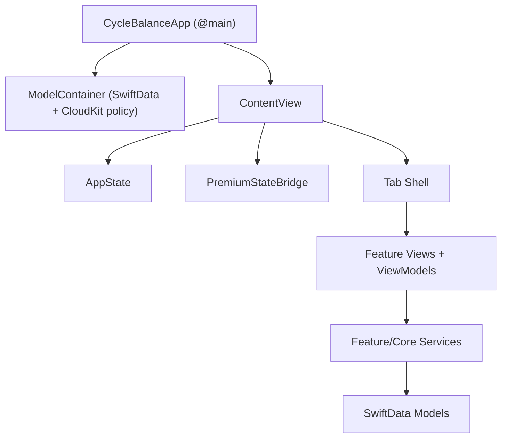
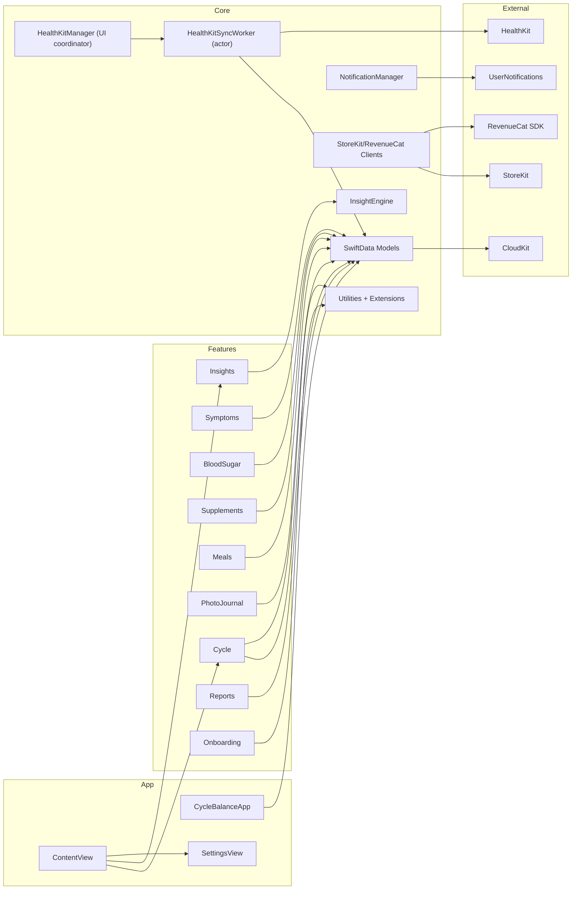

# PCOS Project Map

Audit snapshot date: 2026-03-11  
Evidence refresh run date: 2026-03-12  
Scope: current dirty working tree under `PCOS_Management` (modified + untracked files included).

## Baseline

| Area | Current State |
|---|---|
| Primary framework | SwiftUI-first (`@main` app + SwiftUI feature views) |
| UIKit usage | Hybrid edge bridges only (`PDFReportGenerator`, camera/image picker bridge, haptics via `UINotificationFeedbackGenerator`) |
| Dependency management | XcodeGen (`project.yml`) + Swift Package Manager |
| Third-party dependencies | RevenueCat via SPM (`purchases-ios-spm`, resolved at 5.61.0 in current builds) |
| Pattern strategy | MVVM-style feature view models (`@Observable`) + focused service layer |
| Persistence | SwiftData (`@Model`, `ModelContext`, `ModelContainer`) with CloudKit private DB intent and debug/test fallbacks |
| Networking/billing stack | No first-party REST client layer; subscription/network flows via RevenueCat + StoreKit abstraction |
| Concurrency model | Swift 6 strict concurrency (`SWIFT_STRICT_CONCURRENCY = complete`), async/await, task-based listeners |
| Test stack | Swift Testing + XCTest UI tests |

## Entry Point And Runtime Flow

- Application entry point: `PCOS/PCOS/App/CycleBalanceApp.swift` (`@main CycleBalanceApp`).
- `CycleBalanceApp` creates shared SwiftData container and injects it into the scene.
- Root UI: `ContentView` gates onboarding and hosts the tab shell (`Today`, `Calendar`, `Track`, `Insights`, `Settings`).

## Module Dependency Visualization

## Persistence And Networking Stack

- Persistence implementation:
  - SwiftData models in `Core/Data/SwiftData`.
  - CloudKit container target: `iCloud.com.cyclebalance.app`.
  - Startup policy supports in-memory test mode and debug local fallback.
- Networking and subscription implementation:
  - No app-owned `URLSession` endpoint layer was found.
  - Billing and entitlement updates are delegated to `RevenueCatBillingClient` and `StoreKitBillingClient`.

## App Store Configuration Status

| Artifact | Active Location | Status | Notes |
|---|---|---|---|
| App Info.plist | `PCOS/PCOS/Info.plist` | Present | Contains camera/photo/HealthKit usage strings and launch screen dictionary. |
| Background mode declaration (`UIBackgroundModes`) | `PCOS/PCOS/Info.plist` | Compliant for current scope | `remote-notification` declaration removed in H-1 remediation; app currently targets local notifications only. |
| Active app entitlements | `PCOS/PCOS.entitlements` | Present | This is the Xcode build input (`ProcessProductPackaging ... PCOS/PCOS.entitlements`). |
| Duplicate entitlements (non-active) | `PCOS/PCOS/PCOS.entitlements` | Present (non-active) | Traceability artifact; not current build input. |
| Mirror entitlements (non-active tree) | `CycleBalance/CycleBalance.entitlements` | Present (non-active) | Kept for parity workflow only. |
| App privacy manifest | `PCOS/PCOS/PrivacyInfo.xcprivacy` | Present | Declares `NSPrivacyAccessedAPICategoryUserDefaults` reason `CA92.1`. |
| Mirror privacy manifest (non-active tree) | `CycleBalance/PrivacyInfo.xcprivacy` | Present (non-active) | Kept for parity workflow. |
| Active asset catalog | `PCOS/PCOS/Assets.xcassets` | Present | Catalog contains accent + app icon set. |
| Active app icon set | `PCOS/PCOS/Assets.xcassets/AppIcon.appiconset` | Present and populated | `Contents.json` now maps concrete default/dark/tinted 1024 PNG files. |
| Mirror app icon set (non-active tree) | `CycleBalance/Resources/Assets.xcassets/AppIcon.appiconset` | Present and populated | Mirrored icon assets and manifest entries are in sync. |
| Launch screen config | `PCOS/PCOS/Info.plist` (`UILaunchScreen`) | Present | Empty launch-screen dict configured. |
| Dependency manager config | `project.yml` | Present | XcodeGen source of truth for targets, entitlements, and SPM package wiring. |
| CocoaPods/Carthage manifests | repo root scan (`Podfile`, `Cartfile`) | Not found | Confirms SPM-only external dependency path in current tree. |

## Built Artifact Validation (Icon + Background Mode Readiness)

- Release app metadata check passed (2026-03-12): built `PCOS.app/Info.plist` contains `CFBundleIcons`, `CFBundlePrimaryIcon`, and `CFBundleIconName = AppIcon`.
- Release app metadata check passed (2026-03-12): built `PCOS.app/Info.plist` does not contain `UIBackgroundModes` / `remote-notification`.
- Release asset catalog check passed (2026-03-12): `assetutil --info PCOS.app/Assets.car` includes `AssetType: Icon Image` entries with `Name: AppIcon`.

## H-2 Verification Note (Insight Error Handling)

- Insight generation now uses fail-fast fetch behavior (throwing `InsightEngine.generateInsights`) instead of silent SwiftData fetch fallbacks.
- UI propagation now includes `InsightsViewModel.errorMessage` with rollback on refresh failure plus inline error banner rendering in `InsightsView`.
- Guardrail and behavior tests passed in active and mirrored trees:
  - no `try? modelContext.fetch` silent fallback pattern in `InsightEngine.swift`,
  - refresh failure surfaces error and does not persist insights,
  - successful refresh clears stale error and persists insights.

## H-3 Verification Note (HealthKit Full-Sync Isolation)

- `HealthKitManager` remains `@MainActor` for observable UI state, but full-sync execution now delegates via injected sync operation:
  - `PCOS/PCOS/Core/HealthKit/HealthKitManager.swift:14`
  - `PCOS/PCOS/Core/HealthKit/HealthKitManager.swift:57-84`
  - `PCOS/PCOS/Core/HealthKit/HealthKitManager.swift:119-140`
- Dedicated `HealthKitSyncWorker` actor now owns full-sync HealthKit fetch and SwiftData fetch/upsert on a worker `ModelContext`:
  - `PCOS/PCOS/Core/HealthKit/HealthKitSyncWorker.swift:16`
  - `PCOS/PCOS/Core/HealthKit/HealthKitSyncWorker.swift:47-76`
  - `PCOS/PCOS/Core/HealthKit/HealthKitSyncWorker.swift:80-185`
- Guardrail and behavior tests passed in active and mirrored trees:
  - manager no longer contains direct `modelContext.fetch/save` sync-loop patterns,
  - success path updates `lastSyncDate`, clears stale `lastError`, and resets `isSyncing`,
  - failure path sets `lastError` and resets `isSyncing` without corrupting sync state,
  - worker upsert/dedup behavior passes with in-memory SwiftData.

## M-5 Verification Note (StoreKit Observer Teardown)

- `PremiumStateBridge` now exposes explicit lifecycle teardown with `stop()` and deinit cancellation:
  - `PCOS/PCOS/Core/StoreKit/PremiumStateBridge.swift:20`
  - `PCOS/PCOS/Core/StoreKit/PremiumStateBridge.swift:37-39`
- Root app shell now invokes bridge stop on disappearance:
  - `PCOS/PCOS/App/ContentView.swift:53-55`
- `SubscriptionManager` now exposes `stopEntitlementListener()` and deinit teardown:
  - `PCOS/PCOS/Core/StoreKit/SubscriptionManager.swift:67-69`
  - `PCOS/PCOS/Core/StoreKit/SubscriptionManager.swift:172-174`
- Entitlement listener now avoids `self.billingClient` strong-loop pattern by consuming captured `billingClient` in the async stream loop:
  - `PCOS/PCOS/Core/StoreKit/SubscriptionManager.swift:188-193`
- Guardrail and behavior tests passed in active and mirrored trees:
  - `StoreKit Lifecycle Regressions` source guardrails in both test trees,
  - `PremiumStateBridgeTests` verifies stop prevents post-stop notification refresh,
  - `SubscriptionManagerTests` verifies listener updates stop deterministically after explicit stop.

## M-4 Verification Note (InsightEngine Responsibility Split)

- `InsightEngine` remains the public coordinator with unchanged throwing API (`generateInsights() throws -> [Insight]`), while internal concerns are now delegated:
  - `PCOS/PCOS/Core/ML/InsightEngine.swift:6-7`
  - `PCOS/PCOS/Core/ML/InsightEngine.swift:54-79`
- Dedicated internal units now own fetch, dedup/cleanup, and domain analyzers:
  - `InsightDataFetcher` (`PCOS/PCOS/Core/ML/InsightEngine.swift:90`)
  - `InsightDeduplicator` (`PCOS/PCOS/Core/ML/InsightEngine.swift:109`)
  - `CyclePatternInsightAnalyzer` (`PCOS/PCOS/Core/ML/InsightEngine.swift:186`)
  - `SymptomCorrelationInsightAnalyzer` (`PCOS/PCOS/Core/ML/InsightEngine.swift:291`)
  - `SupplementEfficacyInsightAnalyzer` (`PCOS/PCOS/Core/ML/InsightEngine.swift:475`)
  - `DietImpactInsightAnalyzer` (`PCOS/PCOS/Core/ML/InsightEngine.swift:571`)
  - `SleepActivityInsightAnalyzer` (`PCOS/PCOS/Core/ML/InsightEngine.swift:692`)
- Architecture guardrails now enforce split boundaries in both test trees:
  - `PCOS/PCOSTests/SilentFailureRegressionTests.swift:96-126`
  - `CycleBalanceTests/SilentFailureRegressionTests.swift:96-126`
- Existing insight behavior/error suites continue to pass with the split coordinator structure.

## M-3 Verification Note (Dynamic Type Resilience)

- Supplement adherence rings now use scaled, clamped sizing instead of fixed `120x120` dimensions:
  - `PCOS/PCOS/Features/Supplements/Views/SupplementHistoryView.swift:6`
  - `PCOS/PCOS/Features/Supplements/Views/SupplementHistoryView.swift:76`
  - `PCOS/PCOS/Features/Supplements/Views/SupplementHistoryView.swift:85`
  - `PCOS/PCOS/Features/Supplements/Views/SupplementHistoryView.swift:138`
- Blood sugar history time column now uses adaptive single-line sizing (`minWidth`/`idealWidth`) with scale-down support:
  - `PCOS/PCOS/Features/BloodSugar/Views/BloodSugarHistoryView.swift:6`
  - `PCOS/PCOS/Features/BloodSugar/Views/BloodSugarHistoryView.swift:72`
  - `PCOS/PCOS/Features/BloodSugar/Views/BloodSugarHistoryView.swift:73`
- Calendar blank-offset cells now use minimum-height behavior (`minHeight: 44`) instead of fixed height:
  - `PCOS/PCOS/Features/Cycle/Views/CalendarMonthView.swift:137`
- Guardrail tests now enforce adaptive replacements and block prior fixed-size patterns in both test trees:
  - `PCOS/PCOSTests/InterfaceResilienceTests.swift:47-77`
  - `CycleBalanceTests/InterfaceResilienceTests.swift:47-77`

## M-2 Verification Note (Quick-Log Error Surfacing)

- Quick period logging in `TodayView` no longer uses silent fallback fetch for undo anchor lookup and no longer suppresses save errors:
  - `PCOS/PCOS/Features/Cycle/Views/TodayView.swift:341-349`
  - `PCOS/PCOS/Features/Cycle/Views/TodayView.swift:376-399`
- `CycleLogService.logPeriodDay` and `CycleViewModel.logPeriodDay` now return `PersistentIdentifier`, and quick-log undo state is sourced from this deterministic result:
  - `PCOS/PCOS/Features/Cycle/Models/CycleLogService.swift:16-35`
  - `PCOS/PCOS/Features/Cycle/ViewModels/CycleViewModel.swift:69-80`
- Quick-log failures now log diagnostics and surface a concise inline non-modal banner without replacing card layout structure.
- Guardrail and behavior tests passed in active and mirrored trees:
  - `SilentFailureRegressionTests` enforces no silent `try? modelContext.fetch(descriptor)` fallback and no silent quick-log catch suppression,
  - `CycleLogServiceTests` validates returned identifier maps to persisted period entries.

## M-1 Verification Note (Media Import Error Surfacing)

- Meal and photo journal library imports now use explicit `do/try/catch` instead of silent `try?` fallbacks:
  - `PCOS/PCOS/Features/Meals/Views/MealLogView.swift:208-220`
  - `PCOS/PCOS/Features/PhotoJournal/Views/PhotoCaptureView.swift:128-145`
- Import failures now route through the existing alert pathway (`activeAlert = .error(...)`) with error haptics and without replacing existing view layouts.
- Non-selection/cancel paths remain non-error (no alert).
- Guardrail tests now enforce no silent import fallback patterns in both active and mirrored trees:
  - `PCOS/PCOSTests/SilentFailureRegressionTests.swift:140-164`
  - `CycleBalanceTests/SilentFailureRegressionTests.swift:140-164`

## Verification Baseline (Current Tree)

- Parity gate: `./scripts/check_tree_parity.sh` -> passed.
- Focused resource gate (`PCOSTests/PrivacyManifestTests`, `PCOSTests/AppIconAssetTests`, `PCOSTests/AppStoreConfigTests`) -> passed.
- Focused H-2 gate (`PCOSTests/InsightErrorHandlingRegressionTests`, `PCOSTests/InsightsViewModelErrorPropagationTests`, `PCOSTests/InsightEngineTests`) -> passed.
- Focused H-3 gate (`PCOSTests/HealthKitSyncConcurrencyRegressionTests`, `PCOSTests/HealthKitManagerTests`, `PCOSTests/HealthKitSyncWorkerTests`) -> passed (`15 tests in 3 suites passed`).
- Focused M-5 gate (`PCOSTests/StoreKitLifecycleRegressionTests`, `PCOSTests/PremiumStateBridgeTests`, `PCOSTests/SubscriptionManagerTests`) -> passed (`17 tests in 3 suites passed`).
- Focused M-4 gate (`PCOSTests/InsightArchitectureRegressionTests`, `PCOSTests/InsightEngineTests`, `PCOSTests/InsightErrorHandlingRegressionTests`, `PCOSTests/InsightsViewModelErrorPropagationTests`) -> passed (`19 tests in 4 suites passed`).
- Focused M-3 gate (`PCOSTests/InterfaceResilienceTests`) -> passed (`4 tests in 1 suite passed`).
- Focused M-2 gate (`PCOSTests/SilentFailureRegressionTests`, `PCOSTests/CycleLogServiceTests`) -> passed (`18 tests in 2 suites passed`).
- Focused M-1 gates (`PCOSTests/SilentFailureRegressionTests`; plus `PCOSTests/MealViewModelTests` and `PCOSTests/PhotoJournalViewModelTests`) -> passed.
- Full simulator test gate (`scheme PCOS`, iPhone 17 / iOS 26.2) -> passed (`223 tests in 43 suites` + UI tests).
- Release no-sign build gate (`CODE_SIGNING_ALLOWED=NO`) -> passed (`BUILD SUCCEEDED`).

## Traceability: Non-Active Duplicate Config Artifacts

- `PCOS/PCOS/PCOS.entitlements`
- `CycleBalance/CycleBalance.entitlements`
- `CycleBalance/PrivacyInfo.xcprivacy`
- `CycleBalance/Resources/Assets.xcassets/**`

These exist for mirror/parity workflow traceability and are not the active build input for the current `PCOS` app target.
